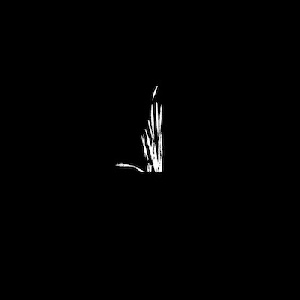
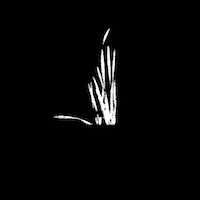
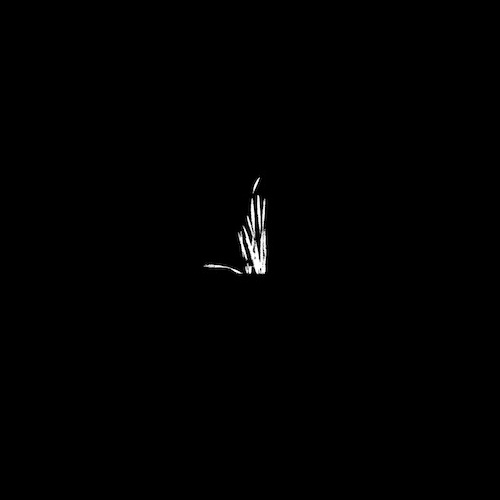
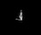

## Resize

Resizes images, used to resize masks over other images.

**plantcv.transform.resize**(*img, size, interpolation="auto"*)

**returns** image after resizing

- **Parameters:**
    - img - RGB or grayscale image to resize
    - size - Output image size in pixels (width, height)
    - interpolation - Interpolation method. Available options are "auto" = select method automatically (default),
    "area" = resampling using pixel area (OpenCV INTER_AREA), "bicubic" = bicubic interpolation (OpenCV INTER_CUBIC),
    "bilinear" = bilinear interpolation (OpenCV INTER_LINEAR), "lanczos" = Lanczos interpolation (OpenCV INTER_LANCZOS4),
    "nearest" = nearest-neighbor interpolation (OpenCV INTER_NEAREST), None = disable interpolation and crop or pad instead.
- **Context:**
    - Resizes images to a desired exact size.
- **Example use:**
    - Below

## Resize by a scaling factor

**plantcv.transform.resize_factor**(*img, factors, interpolation="auto"*)

**returns** image after resizing

- **Parameters:**
    - img - RGB or grayscale image to resize
    - factors - Resizing factors (width, height). E.g. (0.5, 0.5)
    - interpolation - Interpolation method. Available options are "auto" = select method automatically (default),
    "area" = resampling using pixel area (OpenCV INTER_AREA), "bicubic" = bicubic interpolation (OpenCV INTER_CUBIC),
    "bilinear" = bilinear interpolation (OpenCV INTER_LINEAR), "lanczos" = Lanczos interpolation (OpenCV INTER_LANCZOS4),
    "nearest" = nearest-neighbor interpolation (OpenCV INTER_NEAREST).
- **Context:**
    - Resizes images based on resizing factors along x and y axes. If the same resizing factor is adopted for both x 
    and y axis, the resizing would preserve the aspect ratio of the original image.
- **Example use:**
    - Below

**Input image**

Size of input image 400x335 (width x height)


```python

from plantcv import plantcv as pcv

# Set global debug behavior to None (default), "print" (to file), 
# or "plot" (Jupyter Notebooks or X11)
pcv.params.debug = "plot"
# Resize image using resize function, with interpolation, and default interpolation method
resize_img1 = pcv.transform.resize(img=img, size=(300, 300), interpolation="auto")

# The interpolation method can be specified
resize_img2 = pcv.transform.resize(img=img, size=(300, 300), interpolation="nearest")

# Resize image using resize function, by cropping
resize_img3 = pcv.transform.resize(img=img, size=(200, 200), interpolation=None)

# Resize image using resize function, by zero-padding
resize_img4 = pcv.transform.resize(img=img, size=(500, 500), interpolation=None)

# Resize image using the resize_factor function
# Note, in this example, the resizing factor for x and y are the same, so the aspect ratio of the original image is preserved 
resize_img5 = pcv.transform.resize_factor(img=img, factors=(0.1154905775, 0.1154905775), interpolation="auto")

```

**Images after resizing**
**1st resized image (default interpolation)


**2nd resized image (Interpolation by nearest)**



**3rd resized image (cropping)**



**4th resized image (zero-padding)**



**5th resized image (by factor)**



**Source Code:** [Here](https://github.com/danforthcenter/plantcv/blob/main/plantcv/plantcv/transform/resize.py)
