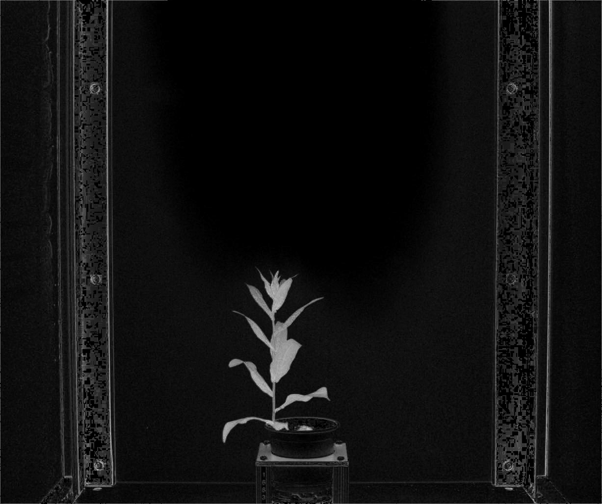
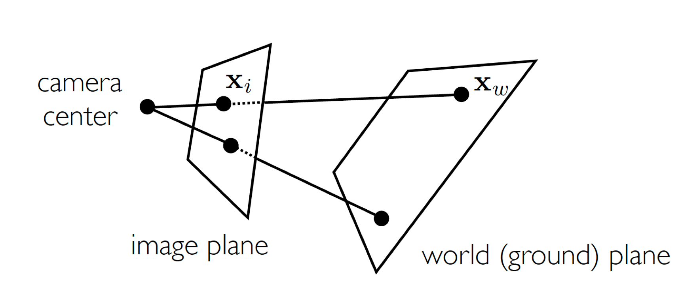

## Warp

Find the transformation matrix that best describes the projective transform from reference image to target image, based on pairs of corresponding points on reference image and target image, respectively;
performs the projective transform on the target image to righ it with the reference image. 

In general, any geometric transformation between 4 pairs of corresponding points is considered as projective transform. 
- Projective Transform: preservs lines but not necessarily parallelism. There are several special cases of projective transform. 
  - Euclidean Transform (righd transform): preserves the Euclidean distance between pairs of points. It can be described as a rotation about the origin followed by a translation.
    - Similarity Transform: preserves the shape of objects. It combines scaling, translation and rotation. 
  - Affine Transform: preserves lines (hence the alignment of objects), as well as parallelism between lines. It can be decomposed into a similarity transform and a shear transformation.
  

Projective transformation describs most cases when images are taken from a slight different point of view, or even taken with different cameras. 

Read about different transformations at [Image Processing in OpenCV](https://docs.opencv.org/3.4/da/d6e/tutorial_py_geometric_transformations.html) and the [transform module of scikit-image](https://scikit-image.org/docs/dev/api/skimage.transform.html#skimage.transform.estimate_transform). 

### warp 
**plantcv.transform.warp**(*img, refimg, pts, refpts, method="default"*)

**returns** image after warping and a 3x3 matrix of the perspective transformation.

- **Parameters:**
    - img - (np.ndarray) image to warp (np.ndarray)
    - refimg - (np.ndarray) image used as a reference for the warp 
    - pts - (list) coordinate points on `img`. At least 4 pairs should be given as a list of tuples
    - refpts - (list) corresponding coordinate points on `refimg`. At least 4 pairs should be given as a list of tuples
    - method - (str) robust estimation algorithm when calculating projective transformation. Available options are 'default', 'ransac', 'lmeds', 'rho' which correspond to the opencv methods and [vary based on how they handle outlier points](https://docs.opencv.org/3.4/d9/d0c/group__calib3d.html#ga4abc2ece9fab9398f2e560d53c8c9780)
      - Any 4 pairs of corresponding points can define a projective transform. More than 4 pairs given means there are outliers. 
      - Robust estimation algorithms can be used to estimate the model based only on inliers to find a robust model.
      - Using 'default' means that a regular method using all the points without robustness i.e., the least squares method, is adopted.
- **Context:**
    - Warps an image without preserving parallel lines. 
- **Example use:**

1. A mask derived from an RGB image can be used to segment an NIR image which is difficult to segment otherwise.

**Input image**

A mask derived from a RGB image 2056x2454


An image from a SWIR camera is used as the reference image to define the transformation is 7000x5000



In this case we know the field of view of the two images is the same, so we can use the image corners to define the transformation. In other cases you might need to establish corresponding control points in each image.

```python

from plantcv import plantcv as pcv

# Set global debug behavior to None (default), "print" (to file),
# or "plot" (Jupyter Notebooks or X11)
mrow, mcol = mask.shape
vrow, vcol, vdepth = grayimg.shape

img_warped, mat = pcv.transform.warp(img=mask,
                                refimg=grayimg,
                                pts = [(0,0),(mcol-1,0),(mcol-1,mrow-1),(0,mrow-1)],
                                refpts = [(0,0),(vcol-1,0),(vcol-1,vrow-1),(0,vrow-1)],
                                method='default')


```
2. Register the RGB image to the corresponding thermal image based on landmark points so that the mask derived from it can be used to pull out plant pixels from the corresponding thermal image.

**Input Image**
A thermal image (reference image) and its corresponding RGB image (target image).

Overlay the thermal image on corresponding RGB image before image registration:

Pairs of corresponding landmard points on both images:

Check back later for information of getting landmark coordinates to registrate two images in a user-friendly interactive way!

```python

from plantcv import plantcv as pcv
pcv.params.marker_size=12
img_warped, mat = pcv.transform.warp(img=im_RGB,
                                refimg=im_therm,
                                pts=pts_RGB,
                                refpts=pts_therm)
```

Warped RGB image:


Overlay the thermal image on warped RGB image:


Reference image with markers:


Target image with markers:


A pair of correaponding inlier points are represented with the same color with the "+" marker; the outliers are represented using upper triangles. 

### warp_align
**plantcv.transform.warp_align**(*img, mat, refimg=None)*

**returns** image after warping.

Highly related to the `warp` function, the `warp_align` function takes an input image, a transformation mask, and perform the geometric transformation defined by the given transformation matrix. 
- **Parameters:**
    - img - (np.ndarray) image to warp 
    - mat - (np.ndarray) a 3x3 matrix that describes the projective transformation. Tyically, it would be the 2nd output of the `transform.warp` function.
    - refimg (optional) - (np.ndarray) image used as a reference for the warp. If provided, the warped image would be overlaid on the reference image to visualize; otherwise, the warped image would be overlaied on the original image.

- **Context:**
    - Warps an image based on the transformation matrix. 
    
- **Example use:**
```python

from plantcv import plantcv as pcv
import numpy as np
# M1 is the 2nd output from pcv.transform.warp
img_warped  = pcv.transform.warp_align(img=im_RGB,mat=M1, refimg=im_therm)

# M2 defines a translation transformation, which is a special case of projective transformation
M2 = np.array([[1.0,0.0,100.0],[0.0,1.0,50.0],[0.0,0.0,1.0]])
img_warped2 = pcv.transform.warp_align(img=im_RGB,mat=M2)
```

Warped image:


Superimposed image of the warped image and the reference image (reference image provided):


Warped image:


Superimposed image of the warped image and the original image (reference image not provided):


**Source Code:** [Here](https://github.com/danforthcenter/plantcv/blob/master/plantcv/plantcv/transform/warp.py)

**Appendix**: Notes on image transformation
A 2D image transformation is defined as transform all points in coordinate system 1 to coordinate system 2, which can be denoted as: P(x,y)->P'(x',y').
So we have 

 

For several basic 2D transformations:

- **Image Scaling**:

 

- **Shear Transformation**:

 

- **Rotation**

 

These basic 2D image transformations are also known 2D **Linear** Transformations. Several characteristics of 2D Linear Transformation:
- Combinations of scale, rotation, shear, and mirror
- Only involves linear combinatsions of parameters a, b, c, and d
- Origin maps to origin
- Lines map to lines
- Parallel lines remain prarllel
- Ratios preserved

Another important 2D image transformation is call 2D translation, which can be expressed as 

 

However, there is not one 2D matrix can be used to describe this transformation. So the **homogeneous coordinates** are needed. 
Long sentence short, using homogeneous coordinates is representing coordinates in 2 dimensions with a 3-dimensional vector. In equations we have

 

For the purpose of conventional, we have

 

With points in 2D spaces represented in this homogeneous coordinates, the basic 2D transformations can be represented in new ways:

- **Image Scaling**:

 

- **Rotation**

 

- **Shear Transformation**:

 

- **Translation**:

 

These 2D images transformations described by homogeneour coordinates are also known as 2D **affine** transformations. Affine transformation combines linear transformations and translation. In equations we have:
 

Let , we have


Notice that there are 6 defrees of freedom for this matrix, which means at least **3 pairs** of points (6 points) are needed to define an affine transformation.

The properties of 2D affine transformations:
- Origins don't necessarily map to origins
- Lines map to lines
- Parallelization and ratios preserved

Another important transformation, **projective transformation**, which combines affine transformation and projective warps, is the tranforamtion model used most cases of image registration. 
The properties of projective transformations:
- Origins don't necessarily map to origina
- Lines map to lines
- Neither parallelization nor ratios preserved

A projective transformation is represented as 


Notice that there are 8 degrees of freedom for this transformation matrix, which implies that at least 4 pairs of points (8 points) are needed to define a projective transformation. 

The process of a camera taking an image is actually mapping points on a ground plane (world points) to the image of the camera (image points).



We now know that with the homogeneous coordinate, we can describe the process of taking an image using a 3 by 3 transformation matrix (homography)

For two or more images of the same view captured from different perspectives, if we want to learn the transformation from one image coordinate to another, we can still use a projective transformation matrix. 
That explaines the reason for at least 4 pairs of points needed. 

However, when trying to get a robust by applying some robust estimation algorithm, e.g. RANSAC, more than 4 pais of points should be provided.
