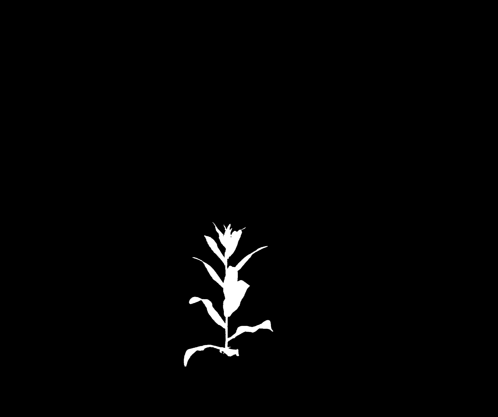
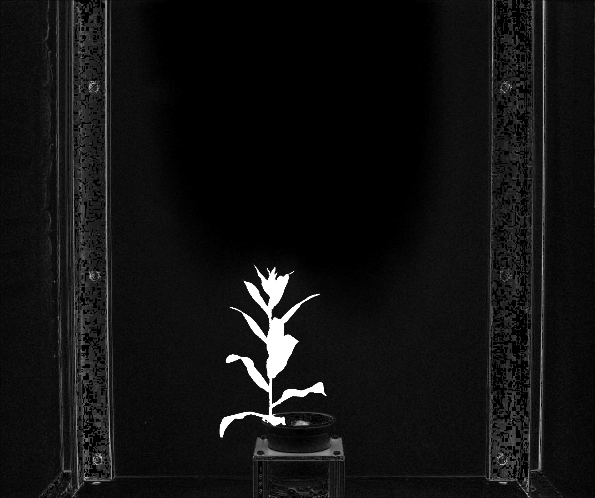

## Warp

Performs either a perspective transformation or affine transformation based on ground control points to align images. 
Read about different transformations at [OpenCV](https://docs.opencv.org/3.4/da/d6e/tutorial_py_geometric_transformations.html)

### warp_perspective 
**plantcv.transform.warp_perspective**(*img, refimg, pts, refpts, method="default"*)

**returns** image after warping and a 3x3 matrix of the perspective transformation.

- **Parameters:**
    - img - image to warp (np.ndarray)
    - refimg - image used as a reference for the warp (np.ndarray)
    - pts - coordinate points on `img`. 4 pairs should be given as a list of tuples
    - refpts - corresponding coordinate points on `refimg`. 4 pairs should be given as a list of tuples
    - method - method of calculating the transformation matrix. Available options are 'default', 'ransac', 'lmeds', 'rho' which correspond to the opencv methods and [vary based on how they handle outlier points](https://docs.opencv.org/3.4/d9/d0c/group__calib3d.html#ga4abc2ece9fab9398f2e560d53c8c9780)
- **Context:**
    - Warps an image without preserving parallel lines. 
- **Example use:**

A mask derived from an RGB image can be used to segment an NIR image which is difficult to segment otherwise.

**Input image**

A mask derived from a RGB image 2056x2454


An image from a SWIR camera is used as the reference image to define the transformation is 7000x5000


In this case we know the field of view of the two images is the same so we can use the image corners to define the transformation. In other cases you might need to establish corresponding control points in each image.

```python

from plantcv import plantcv as pcv

# Set global debug behavior to None (default), "print" (to file),
# or "plot" (Jupyter Notebooks or X11)
mrow, mcol = mask.shape
vrow, vcol, vdepth = grayimg.shape

mat, img_warped = pcv.transform.warp(img=mask,
                                refimg=grayimg,
                                pts = [(0,0),(mcol-1,0),(mcol-1,mrow-1),(0,mrow-1)],
                                refpts = [(0,0),(vcol-1,0),(vcol-1,vrow-1),(0,vrow-1)]),
                                method='default')


```
Here is the warped mask:


Here is the warped mask overlayed on the reference image:


### warp_affine 
- **Parameters:**
    - img - image to warp (np.ndarray)
    - refimg - image used as a reference for the warp (np.ndarray)
    - pts - coordinate points on `img`. 3 pairs should be given as a list of tuples
    - refpts - corresponding coordinate points on `refimg`. 3 pairs should be given as a list of tuples
- **Context:**
    - Warps an image with parallel lines preserved
  
- **Example use:**
Register the RGB image to the corresponding thermal image based on landmark points so that the mask derived from it can be used to pull out plant pixels from the corresponding thermal image.

Overlay thermal image and corresponding RGB image before image registration:

Check back later for information of getting landmark coordinates to registrate two images in a user-friendly interactive way!

```python

from plantcv import plantcv as pcv
mat, img_warped = pcv.transform.warp(img=im_RGB,
                                refimg=im_therm,
                                pts=pts_RGB,
                                refpts=ptr_therm)
```
Before image registration


Warped RGB image


After image registration


**Source Code:** [Here](https://github.com/danforthcenter/plantcv/blob/master/plantcv/plantcv/transform/warp.py)
