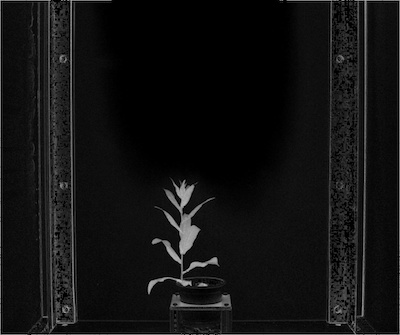
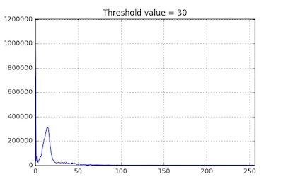
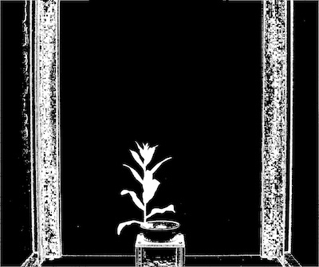
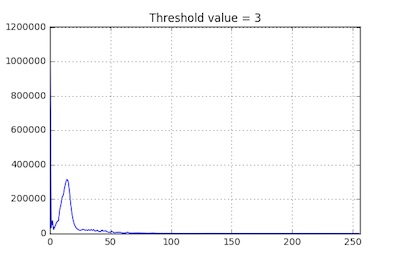
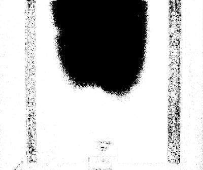

## Triangle Auto Threshold

Creates a binary image from a gray image using adaptive thresholding.

**plantcv.threshold.triangle(*gray_img, max_value, object_type="light", xstep=1*)**

**returns** thresholded/binary image

- **Parameters:**
    - gray_img - Grayscale image data
    - max_value - Value to apply above threshold (255 = white)
    - object_type - "light" or "dark" (default: "light"). If object is lighter than the background then standard 
    thresholding is done. If object is darker than the background then inverse thresholding is done.
    - xstep - Value to move along x-axis to determine the points from which to calculate distance
              recommended to start at 1 (default) and change if needed.
- **Context:**
    - Used to help differentiate plant and background
    

**Grayscale image (green-magenta channel)**




```python

from plantcv import plantcv as pcv

# Set global debug behavior to None (default), "print" (to file), or "plot" (Jupyter Notebooks or X11)
pcv.params.debug = "print"

# Create binary image from a gray image based
thresholded = pcv.threshold.triangle(gray_img, 255, 'light', xstep=10)
```

**Triangle Auto-Thresholded image (xstep=10)**





```python

from plantcv import plantcv as pcv

# Set global debug behavior to None (default), "print" (to file), or "plot" (Jupyter Notebooks or X11)
pcv.params.debug = "print"

# Create binary image from a gray image based 
thresholded = pcv.threshold.triangle(gray_img, 255, 'light', xstep=1)
```

**Triangle Auto-Thresholded image (xstep=1)**




