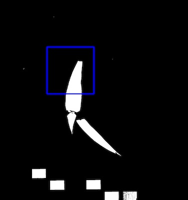
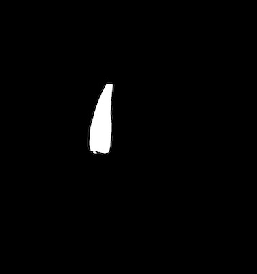
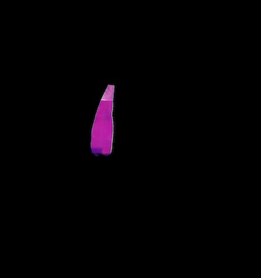
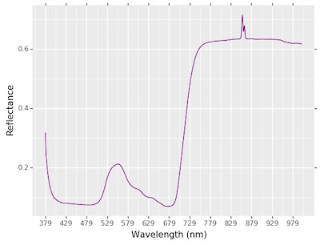

## Tutorial: Hyperspectral Image Workflow

PlantCV is composed of modular functions that can be arranged (or rearranged) and adjusted quickly and easily.
Workflows do not need to be linear (and often are not). Please see workflow example below for more details.
A global variable "debug" allows the user to print out the resulting image. The [debug](../params.md) has three modes: either None, 'plot', or 'print'.
If set to 'print' then the function prints the image out, or if using a [Jupyter](../jupyter.md) notebook you could set debug to 'plot' to have
the images plot to the screen. Debug mode allows users to visualize and optimize each step on individual test images and small test sets before workflows are deployed over whole datasets.

Coming soon: interactive hyperspectral tutorial! 

Also see [here](#Hyperspectral-script) for the complete script. 

**Workflow**

1.  Optimize workflow on individual image with debug set to 'print' (or 'plot' if using a Jupyter notebook).
2.  Run workflow on small test set (that ideally spans time and/or treatments, see the [sample image function](../tools.md).
3.  Re-optimize workflows on 'problem images' after manual inspection of test set.
4.  Deploy optimized workflow over test set using parallelization script.

**Running A Workflow**

To run a hyperspectral workflow over a single hyperspectral image there are two required inputs:

1.  **Image:** ENVI type hyperspectral images are currently compatible with PlantCV, however the functions added to PlantCV are shaped in large part 
by the end users so please post feature requests, questions, and comments on the 
[GitHub issues page](https://github.com/danforthcenter/plantcv/issues). 
2.  **Output directory:** If debug mode is set to 'print' output images from each step are produced, otherwise ~4 final output images are produced.

**Optional inputs:**

*  **Result File:** File to print results to
*  **Write Image Flag:** Flag to write out images, otherwise no result images are printed (to save time).
*  **Debug Flag:** Prints an image at each step
*  **Region of Interest:** The user can input their own binary region of interest or image mask (make sure it is the same size as your image or you will have problems).

**Image Calibration** 

Raw hyperspectral data images often need to be calibrated. This process might look different depending on the hyperspectral camera used,
but one example workflow would use white reference, dark reference images to calibrate raw hyperspectral image datacube into reflectance values. 
[The TERRA-REF team](https://github.com/terraref) has nice documentation on their [calibration protocol](https://docs.google.com/document/d/1w_zHHlrPVKsy1mnW9wrVzAU2edVqZH8i1IZa5BZxVpo/edit#heading=h.jjfbhbos05cc).
Please feel encouraged to reach out to the PlantCV developers/maintainers at the PlantCV [GitHub issues page](https://github.com/danforthcenter/plantcv/issues)
to request to extend the functionality of the [calibration function](../calibrate.md) inside the Hyperspectral sub-package for other calibration protocol. 

Sample command to run a workflow on a single image:  

*  Always test workflows (preferably with -D flag set to 'print') before running over a full image set

```
./workflowname.py --image hyperspectral_ex_img --outdir ./output-images --result results.txt --writeimg --debug 'print'

```

### Walk Through A Sample Workflow

#### Workflows start by importing necessary packages, and by defining user inputs.

```python

#!/usr/bin/env python

import argparse
from plantcv import plantcv as pcv

### Parse command-line arguments
def options():
    parser = argparse.ArgumentParser(description="Imaging processing with opencv")
    parser.add_argument("-i", "--image", help="Input image file.", required=True)
    parser.add_argument("-o", "--outdir", help="Output directory for image files.", required=False)
    parser.add_argument("-r","--result", help="result file.", required= False )
    parser.add_argument("-w","--writeimg", help="write out images.", default=False, action="store_true")
    parser.add_argument("-D", "--debug", help="can be set to 'print' or None (or 'plot' if in jupyter) prints intermediate images.", default=None)
    args = parser.parse_args()
    return args
    
```

#### Start of the Main/Customizable portion of the workflow.

The image input by the user is [read in](../read_image.md).

```python

### Main workflow
def main():
    # Get options
    args = options()
    
    pcv.params.debug=args.debug #set debug mode
    pcv.params.debug_outdir=args.outdir #set output directory
    
    # Read image 
    # Inputs:
    #   filename - Image file to be read in 
    #   mode     - Return mode of image; either 'native' (default), 'rgb', 'gray', 'envi', or 'csv'
    spectral_array = pcv.readimage(filename=args.image, mode='envi')
    
    filename = spectral_array.filename
    
    # Save the pseudo-rgb image that gets created while reading in hyperspectral data
    pcv.print_image(img=spectral_array.pseudo_rgb, filename=filename + "_pseudo-rgb.png")
    
```

**Figure 1.** Psuedo-RGB image from hyperspectral datacube.
The picture in this tutorial we use is a HEADWALL Hyperspec ENVI Standard image. Reading an hyperspectral image in with PlantCV will also create a pseudo-RGB image 
based on the wavelengths available in order to confirm that image data has been read in successfully. This creates an instance of the [`Spectral_data` class](../Spectral_data.md) so the 
object returned has many methods that are useful to users and within PlantCV functions. 


```python        
    # Extract the Green Difference Vegetation Index from the datacube 

    # Inputs:
    #   hsi        - A hyperspectral image, an instance of the `Spectral_data` class in plantcv, 
    #                (read in with pcv.readimage with `mode='envi'`)
    #   distance   - How lenient to be if the required wavelengths 
    #                for a specific index are not available. Amount of flexibility (in nanometers) 
    #                regarding the bands used to calculate an index.
    index_array_gdvi  = pcv.spectral_index.gdvi(hsi=spectral_array, distance=20)
                                                       
```

**Figure 2.** GDVI Grayscale Image.
For this image the Green Difference Vegetation Index was ideal for separating the leaf of interest from the rest of the background. 
We extract this specific index with the [pcv.spectral index.gdvi](../spectral_index.md) function. 


```python
    # Threshold the grayscale image 
    
    # Inputs:
    #   gray_img    - Grayscale image data 
    #   threshold   - Threshold value (between 0-255)
    #   max_value   - Value to apply above threshold (255 = white) 
    #   object_type - 'light' (default) or 'dark'. If the object is lighter than the 
    #                 background then standard threshold is done. If the object is 
    #                 darker than the background then inverse thresholding is done. 
    gdvi_thresh = pcv.threshold.binary(gray_img=index_array_gdvi.array_data, threshold=150, max_value=255)
    
```

**Figure 3.** Thresholded GDVI Image.
Use the grayscale GDVI image to create a mask for the leaf of interest. Take a [binary threshold](../binary_threshold.md). 
 


```python
    # Define ROI 
    
    # Inputs: 
    #   img - RGB or grayscale image to plot the ROI on 
    #   x   - The x-coordinate of the upper left corner of the rectangle 
    #   y   - The y-coordinate of the upper left corner of the rectangle 
    #   h   - The height of the rectangle 
    #   w   - The width of the rectangle 
    roi, roi_hierarchy= pcv.roi.rectangle(img=gdvi_thresh, x=500, y=500, h=300, w=300)
    
``` 

**Figure 4.** Define a rectangular Region of Interest. 
Draw a [rectangular ROI](../roi_rectangle.md) around the leaf of interest. 
 


```python
    # Find Objects 
    
    # Inputs: 
    #   img  - RGB or grayscale image data for plotting 
    #   mask - Binary mask used for detecting contours 
    id_objects, obj_hierarchy = pcv.find_objects(img=index_array_gdvi.array_data, mask=gdvi_thresh)
    
``` 

**Figure 5.** Identify objects. 
[Identify objects](../find_objects.md) in the mask that was created. 


```python
    # Filter object by a defined region of interest 
    
    # Inputs:
    #    img            - img to display kept objects
    #    roi_contour    - contour of roi, output from any ROI function
    #    roi_hierarchy  - contour of roi, output from any ROI function
    #    object_contour - contours of objects, output from pcv.find_objects function
    #    obj_hierarchy  - hierarchy of objects, output from pcv.find_objects function
    #    roi_type       - 'partial' (default, for partially inside), 'cutto', or 
    #                     'largest' (keep only largest contour)
    roi_objects, hierarchy, kept_mask, obj_area = pcv.roi_objects(img=index_array_gdvi.array_data, roi_contour=roi, 
                                                                  roi_hierarchy=roi_hierarchy, 
                                                                  object_contour=id_objects, 
                                                                  obj_hierarchy=obj_hierarchy,
                                                                  roi_type='partial')
                                                               
``` 

**Figure 6.** Binary Mask. 
Binary mask after [filtering objects by the region of interest](../roi_objects.md) that we defined. 



```python
    # Apply the mask of the leaf to the entire datacube, and store it where the datacube is stored. 
    
    # Inputs:
    #   img - RGB image data or hyperspectral image data 
    #   mask - Binary mask image data 
    #   mask_color - 'white' or 'black' 
    spectral_array.array_data = pcv.apply_mask(img=spectral_array.array_data, mask=kept_mask, mask_color="black")
                                                               
``` 

**Figure 7.** Masked datacube. 
[Applying a mask](../apply_mask.md) to the entire datacube can output a debugging image to confirm that the data was masked successfully. 
 


```python
    # Extract reflectance intensity data and store it out to the Outputs class. 
    
    # Inputs:
    #   array        - Hyperspectral data instance  
    #   mask         - Binary mask image data 
    #   hist_plot    - If True plots histogram of reflectance intensity values
    #   label        - Optional label parameter, modifies the variable name of observations recorded. (default `label="default"`)

    analysis_img = pcv.hyperspectral.analyze_spectral(array=spectral_array, mask=kept_mask, histplot=True, label="default")
                                                               
``` 

**Figure 8.** Spectral histogram. 
[Extract reflectance intensity data](../analyze_spectral.md) and store it out to the [Outputs class](../outputs.md). Also, plot the reflectance intensities in a histogram. 
  


```python
    # Extract statistics about an index for the leaf region 
    
    # Inputs:
    #   array        - Hyperspectral index data instance  
    #   mask         - Binary mask image data 
    #   label        - Optional label parameter, modifies the variable name of observations recorded. (default `label="default"`)

    pcv.hyperspectral.analyze_index(array=index_array_gdvi, mask=kept_mask, label="default")
                                                               
``` 

[Extract reflectance statistics from an index](../analyze_index.md) and store it out to the Outputs class.


```python
    # Write shape and color data to results file
    pcv.outputs.save_results(filename=args.result)
     
if __name__ == '__main__':
    main()                                                          
``` 


## Hyperspectral Script
In the terminal:

```
./workflowname.py -i testimg.png -o ./output-images -r results.txt -w -D 'print'

```
*  Always test workflows (preferably with -D flag set to 'print') before running over a full image set

Python script: 

```python
#!/usr/bin/env python

import argparse
from plantcv import plantcv as pcv


### Parse command-line arguments
def options():
    parser = argparse.ArgumentParser(description="Imaging processing with opencv")
    parser.add_argument("-i", "--image", help="Input image file.", required=True)
    parser.add_argument("-o", "--outdir", help="Output directory for image files.", required=False)
    parser.add_argument("-r", "--result", help="result file.", required=False)
    parser.add_argument("-w", "--writeimg", help="write out images.", default=False, action="store_true")
    parser.add_argument("-D", "--debug",
                        help="can be set to 'print' or None (or 'plot' if in jupyter) prints intermediate images.",
                        default=None)
    args = parser.parse_args()
    return args

#### Start of the Main/Customizable portion of the workflow.

### Main workflow
def main():
    # Get options
    args = options()
    
    pcv.params.debug=args.debug #set debug mode
    pcv.params.debug_outdir=args.outdir #set output directory
    
    # Read image (readimage mode defaults to native but if image is RGBA then specify mode='rgb')
    # Inputs:
    #   filename - Image file to be read in 
    #   mode     - Return mode of image; either 'native' (default), 'rgb', 'gray', 'envi', or 'csv'
    spectral_array = pcv.readimage(filename=args.image, mode='envi')
    
    filename = spectral_array.filename
    
    # Save the pseudo-rgb image that gets created while reading in hyperspectral data
    pcv.print_image(img=spectral_array.pseudo_rgb, filename=filename + "_pseudo-rgb.png")
    
    # Extract the Green Difference Vegetation Index from the datacube 
    index_array_gdvi  = pcv.spectral_index.gdvi(hsi=spectral_array, distance=20)
                                                    
    # Threshold the grayscale image 
    gdvi_thresh = pcv.threshold.binary(gray_img=index_array_gdvi.array_data, threshold=150, max_value=255)

    # Define ROI 
    roi, roi_hierarchy= pcv.roi.rectangle(img=gdvi_thresh, x=500, y=500, h=300, w=300)

    # Find Objects 
    id_objects, obj_hierarchy = pcv.find_objects(img=index_array_gdvi.array_data, mask=gdvi_thresh)
    
    # Filter object by a defined region of interest 
    roi_objects, hierarchy, kept_mask, obj_area = pcv.roi_objects(img=index_array_gdvi.array_data, roi_contour=roi, 
                                                                  roi_hierarchy=roi_hierarchy, 
                                                                  object_contour=id_objects, 
                                                                  obj_hierarchy=obj_hierarchy,
                                                                  roi_type='partial')
  
    # Apply the mask of the leaf to the entire datacube, and store it where the datacube is stored.
    spectral_array.array_data = pcv.apply_mask(img=spectral_array.array_data, mask=kept_mask, mask_color="black")
                                                               
    # Extract reflectance intensity data and store it out to the Outputs class. 
    analysis_img = pcv.hyperspectral.analyze_spectral(array=spectral_array, mask=kept_mask, histplot=True)
    
    # Extract statistics about an index for the leaf region 
    pcv.hyperspectral.analyze_index(array=index_array_gdvi, mask=kept_mask)
    
    # Write shape and color data to results file
    pcv.outputs.save_results(filename=args.result)
    
if __name__ == '__main__':
    main()
    
```
