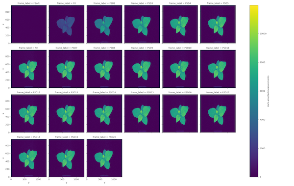
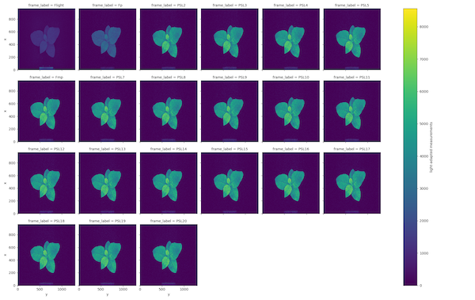
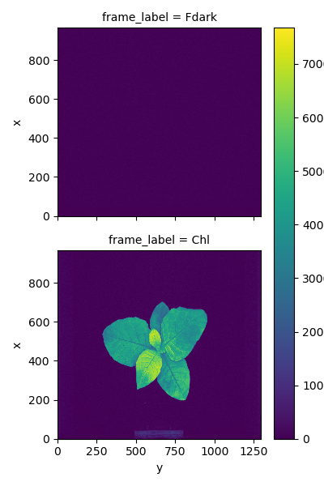
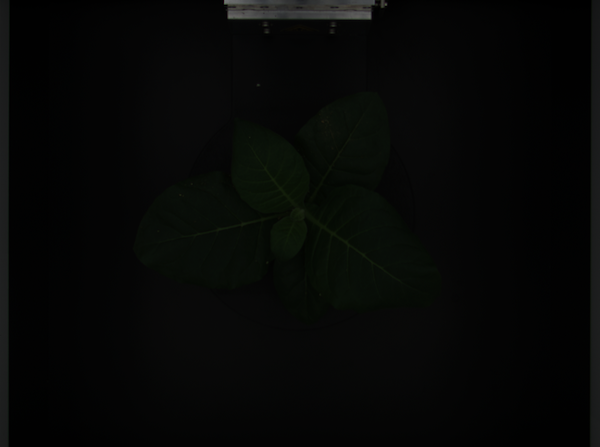
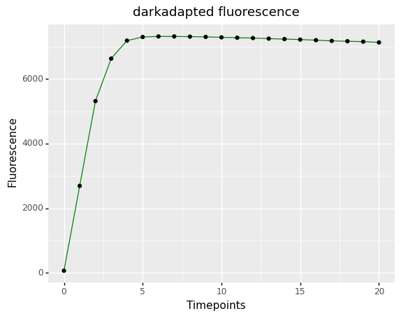
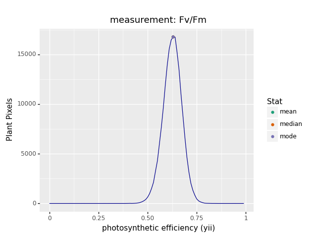
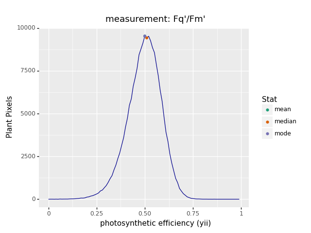
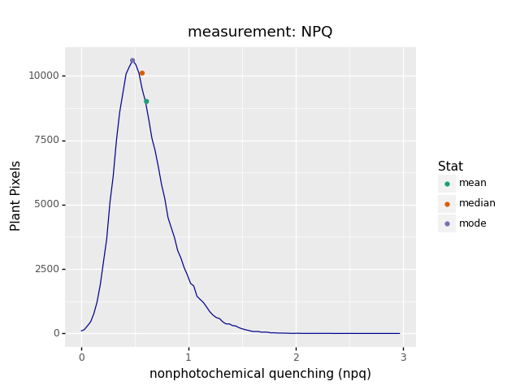
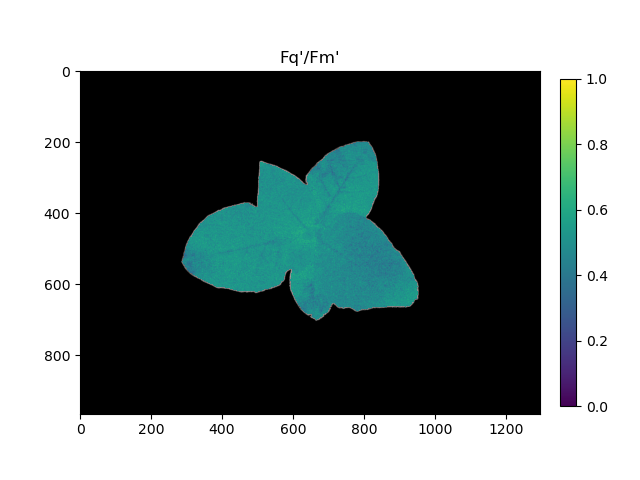

## Tutorial: Photosystem II Analysis Workflow

PlantCV is composed of modular functions that can be arranged (or rearranged) and adjusted quickly and easily.
Workflows do not need to be linear (and often are not). Please see workflow example below for more details.
A global variable "debug" allows the user to print out the resulting image.
The debug has three modes: either None, 'plot', or 'print'. If set to
'print' then the function prints the image out, or if using a [Jupyter](../jupyter.md) notebook you could set debug to 
'plot' to have the images plot to the screen.
This allows users to visualize and optimize each step on individual test images and small test sets before workflows 
are deployed over whole datasets.

Measurement of chlorophyll fluorescence is a tool that can be used to monitor/estimate photosynthetic performance 
(Baker 2008). Several systems exist that use imaging to detect chlorophyll fluorescence and support multiple measurement
protocols. PlantCV currently supports data from the [PhenoVation CropReporter](https://phenovation.com/) system, which
has measurement protocols for Fv/Fm, Fv'/Fm', Fq'/Fm', NPQ, chlorophyll fluorescence, and spectral reflectance. 
In PlantCV, CropReporter data (and later other data sources) are imported into PlantCV 
[Xarray](http://xarray.pydata.org/en/stable/) DataArrays with frame labels enable quick access to the frames needed to 
measure each parameter. A workflow to analyze Fv/Fm, Fq'/Fm', NPQ, and several spectral indices is outlined.  

Also see [here](#psii-script) for the complete script.

### Citations

Baker NR. 2008. Chlorophyll fluorescence: A probe of photosynthesis in vivo. *Annual Review of Plant Biology* 59:89–113. 
DOI: [10.1146/annurev.arplant.59.032607.092759](https://doi.org/10.1146/annurev.arplant.59.032607.092759).

### Workflow

1.  Optimize workflow on individual image with debug set to 'print' (or 'plot' if using a Jupyter notebook).
2.  Run workflow on small test set (ideally that spans time and/or treatments).  
3.  Re-optimize workflows on 'problem images' after manual inspection of test set.  
4.  Deploy optimized workflow over test set using parallelization script.

### Running A Workflow

The example workflow below utilizes a CropReporter dataset that utilized the Fv/Fm (PSD/NPQ), Fq'/Fm' (PSL/NPQ),
chlorophyll fluorescence (CHL), color (CLR), and spectral (SPC) measurement protocols, but workflows could also be 
designed to analyze data with fewer protocols enabled.

To run this workflow over a single dataset there are 2 required inputs:

1.  **Metadata File:** PSII_HDR.INF (also requires a PSII_PSD.DAT, PSII_PSL.DAT, PSII_CHL.DAT, PSII_CLR.DAT, and 
    PSII_SPC.DAT to be stored at the same location)
2.  **Output directory:** Location where output images (if any) will be saved

This tutorial shows an example workflow for fluorescence images taken with the 
[CropReporter system](https://www.phenovation.com/cropreporter/). CropReporter images are stored in a metadata (.INF) 
file and .DAT files where multiple frames are stored into a single file. 

Optional Inputs:

*  **Writeimg Flag:** Enables saving output images, where applicable
*  **Debug Flag:** Prints or plots (if in Jupyter or have x11 forwarding on) an image at each step

Sample command to run a workflow on a single PSII image set:  

* Always test workflows (preferably with -D flag for debug mode) before running over a full image set.

```
./workflowname.py -i PSII_HDR_020321_WT_TOP_1.INF -o /home/user/output-images -D 'print'

```

### Walk Through A Sample Workflow

Workflows start by importing necessary packages, and by defining user inputs.

```python
#!/usr/bin/env python
import os
import argparse
from plantcv import plantcv as pcv
from skimage.util import img_as_ubyte

### Parse command-line arguments
def options():
    parser = argparse.ArgumentParser(description="Imaging processing with opencv")
    parser.add_argument("-i", "--image", help="Input INF file.", required=True)
    parser.add_argument("-o", "--outdir", help="Output directory for image files.", required=True)
    parser.add_argument("-w", "--writeimg", help="Save output images.", action="store_true")
    parser.add_argument("-D", "--debug", help="Turn on debug, prints intermediate images.", action="store_true")
    args = parser.parse_args()
    return args

```

All required frames are contained within the `.DAT` files. See the documentation page for 
[`plantcv.photosynthesis.read_cropreporter()`](../photosynthesis_read_cropreporter.md) to see more detail on
how this type of data is read in.

```python
### Main workflow
def main():
    # Get options
    args = options()

    pcv.params.debug = args.debug #set debug mode
    pcv.params.debug_outdir = args.outdir #set output directory

    # Read fluorescence image data
    ps = pcv.photosynthesis.read_cropreporter(filename=args.image)

```

**Figure 1.** CropReporter dark-adapted images



From top-left to bottom-right: F-dark (lights off), F0 (minimum fluorescence of dark-adapted plant), and post-saturating
light pulse images (PSD1-PSDn). The frame annotated as containing maximum fluorescence is labeled Fm.

**Figure 2.** CropReporter light-adapted images



From top-left to bottom-right: F-light (lights on), Fp (steady-state fluorescence of light-adapted plant (F')), and 
post-saturating light pulse images (PSL1-PSLn). The frame annotated as containing maximum fluorescence (Fm') is labeled 
Fmp.

**Figure 3.** CropReporter chlorophyll fluorescence images



Top: F-dark, bottom: chlorophyll fluorescence.

**Figure 4.** CropReporter spectral reflectance RGB image



The spectral dataset can contain blue (460nm), green (500nm), red (670nm), green2 (550nm), far-red (700nm), and 
near-infrared (800nm) frames.

`ps` is an instance of the `PSII_data` class in PlantCV. The class stores each available dataset as attributes. The
class stores two dataset attributes (`datapath` and `filename`) and stores each of the datasets with the following
variable names: `darkadapted`, `lightadapted`, `chlorophyll`, `spectral`. The darkadapted, lightadapted, and 
chlorophyll datasets are stored as xarray DataArrays. The spectral dataset is stored as a PlantCV
[Spectral_data](../Spectral_data.md) class instance.

#### Create a binary mask

The chlorophyll fluorescence image can be thresholded to create a binary mask for the entire dataset.
The scikit-image method `img_as_ubyte` converts the image from 16-bit to 8-bit. Thresholding is done
using the autothreshold method [Otsu](../otsu_threshold.md). Missing areas of the plant are filled in
using the [fill_holes](../fill_holes.md) function.

```python
    # Threshold the chlorophyll image

    # Inputs:
    #   gray_img        - Grayscale image data
    #   max_value       - Value to apply above threshold (255 = white)
    #   object_type     - 'light' (default) or 'dark'. If the object is lighter than the
    #                       background then standard threshold is done. If the object is
    #                       darker than the background then inverse thresholding is done.
    mask = pcv.threshold.otsu(gray_img=img_as_ubyte(ps.chlorophyll.sel(frame_label="Chl").data), 
                              max_value=255, object_type="light")
    # Fill small objects

    # Inputs:
    #   bin_img         - Binary image data
    mask = pcv.fill_holes(bin_img=mask)

```

**Figure 5.** Binary mask


#### Relabel the Fm and Fm' frames (optional)

In this experiment, the plant was dark-adapted. An image is taken of the plant in the dark (F-dark). The plant is then
exposed to a saturating red light pulse briefly. An image of chlorophyll fluorescence is taken immediately after the
pulse to measure minimal fluorescence (F0). Successive images are taken at a fixed time interval (20 total frames from
F0 to F19 in this example). Here we will use the [reassign_frame_labels](../photosynthesis_reassign_frame_labels.md)
function to analyze the fluorescence induction curve and identify the frame with maximal fluorescence (Fm).

```python
    # Dark-adapted fluorescence induction curve

    # Inputs:
    # ps_da       = photosynthesis xarray DataArray
    # mask        = mask of plant (binary, single channel)
    # 
    # Returns:
    # ps_da       = dataarray with updated frame_label coordinate
    # ind_fig     = ggplot induction curve of fluorescence
    # ind_df      = data frame of mean fluorescence in the masked region at each timepoint

    dark_da, dark_fig, dark_df = pcv.photosynthesis.reassign_frame_labels(ps_da=ps.darkadapted, mask=mask)

```

**Figure 6.** Dark-adapted fluorescence induction curve.  



After the Fv/Fm protocol, the plant is light-adapted. An image is taken of the plant in the light (F-light). The plant
is then exposed to an actinic light, and an image of chlorophyll fluorescence is taken to measure steady-state
fluorescence (F'). The plant is then exposed to a saturating red light pulse briefly. Successive images are taken at a 
fixed time interval (20 total frames from F0 to F19 in this example). Here we will use the 
[reassign_frame_labels](../photosynthesis_reassign_frame_labels.md) function to analyze the fluorescence induction curve 
and identify the frame with maximal fluorescence (Fm').

```python
    # Light-adapted fluorescence induction curve

    # Inputs:
    # ps_da       = photosynthesis xarray DataArray
    # mask        = mask of plant (binary, single channel)
    # 
    # Returns:
    # ps_da       = dataarray with updated frame_label coordinate
    # ind_fig     = ggplot induction curve of fluorescence
    # ind_df      = data frame of mean fluorescence in the masked region at each timepoint

    light_da, light_fig, light_df = pcv.photosynthesis.reassign_frame_labels(ps_da=ps.lightadapted, mask=mask)

```

**Figure 7.** Light-adapted fluorescence induction curve.  


#### Estimate the efficiency of PSII

Using the dark-adapted and light-adapted datasets, calculate the metric Fv/Fm to estimate the maximum efficiency of
PSII and the metric Fq'/Fm' to estimate the operating efficiency of PSII. In both cases the function 
[analyze_yii](../photosynthesis_analyze_yii.md) is used.

```python
    # Analyze Fv/Fm

    # Inputs:
    # ps_da               = photosynthesis xarray DataArray
    # mask                = mask of plant (binary, single channel)
    # measurement_labels  = labels for each measurement, modifies the variable name of observations recorded
    # label               = optional label parameter, modifies the variable name of observations recorded
    # 
    # Returns:
    # yii       = DataArray of efficiency estimate values
    # hist_fig  = Histogram of efficiency estimate

    fvfm, fvfm_hist = pcv.photosynthesis.analyze_yii(ps_da=dark_da, mask=mask, measurement_labels=["Fv/Fm"])

```

**Figure 8.** Fv/Fm histogram.  



```python
    # Analyze Fq'/Fm'

    # Inputs:
    # ps_da               = photosynthesis xarray DataArray
    # mask                = mask of plant (binary, single channel)
    # measurement_labels  = labels for each measurement, modifies the variable name of observations recorded
    # label               = optional label parameter, modifies the variable name of observations recorded
    # 
    # Returns:
    # yii       = DataArray of efficiency estimate values
    # hist_fig  = Histogram of efficiency estimate

    fqfm, fqfm_hist = pcv.photosynthesis.analyze_yii(ps_da=light_da, mask=mask, measurement_labels=["Fq'/Fm'"])

```

**Figure 9.** Fq'/Fm' histogram.  



#### Estimate non-photochemical quenching

Nonphotochemical quanching (NPQ) can be estimated using the [analyze_npq](../photosynthesis_analyze_npq.md) function.

```python
    # Analyze NPQ

    # Inputs:
    # ps_da_light        = photosynthesis xarray DataArray for which to compute npq
    # ps_da_dark         = photosynthesis xarray DataArray that contains frame_label `Fm`
    # mask               = mask of plant (binary, single channel)
    # measurement_labels = labels for each measurement in ps_da_light, modifies the variable name of observations recorded
    # label              = optional label parameter, modifies the entity name of observations recorded
    # 
    # Returns:
    # npq       = DataArray of npq values
    # hist_fig  = Histogram of npq estimate

    npq, npq_hist = pcv.photosynthesis.analyze_npq(ps_da_light=light_da, ps_da_dark=dark_da, 
                                                   mask=mask, measurement_labels=["NPQ"])

```

**Figure 10.** NPQ histogram.  



Optionally, the Fv/Fm, Fq'/Fm', and NPQ images can be visualized using the [pseudocolor](../visualize_pseudocolor.md)
function to assess the distribution of values across the plant.

```python
    # Pseudocolor the PSII metric images

    # Inputs:
    # gray_img    - grayscale image data
    # obj         - (optional) ROI or plant contour object. If provided, the pseudocolored image gets cropped
    #               down to the region of interest. default = None
    # mask        - (optional) binary mask
    # cmap        - (optional) colormap. default is the matplotlib default, viridis
    # background  - (optional) background color/type, options are "image" (gray_img), "white", or "black"
    #               (requires a mask). default = 'image'
    # min_value   - (optional) minimum value for range of interest. default = 0
    # max_value   - (optional) maximum value for range of interest. default = 255
    # axes        - (optional) if False then x- and y-axis won't be displayed, nor will the title. default = True
    # colorbar    - (optional) if False then colorbar won't be displayed. default = True
    # obj_padding - (optional) if "auto" (default) and an obj is supplied, then the image is cropped to an extent 20%
    #               larger in each dimension than the object. An single integer is also accepted to define the padding
    #               in pixels
    # title       - (optional) custom title for the plot gets drawn if title is not None. default = None
    # bad_mask    - (optional) binary mask of pixels with "bad" values, e.g. nan or inf or any other values considered
    #               to be not informative and to be excluded from analysis. default = None
    # bad_color   - (optional) desired color to show "bad" pixels. default = "red"
    fvfm_cmap = pcv.visualize.pseudocolor(gray_img=fvfm, mask=mask, cmap="viridis", 
                                          min_value=0, max_value=1, title="Fv/Fm")
    fqfm_cmap = pcv.visualize.pseudocolor(gray_img=fqfm, mask=mask, cmap="viridis", 
                                          min_value=0, max_value=1, title="Fq'/Fm'")
    npq_cmap = pcv.visualize.pseudocolor(gray_img=npq, mask=mask, cmap="viridis", 
                                         min_value=0, max_value=1, title="NPQ")

```

**Figure 11.** Pseudocolored Fv/Fm.  


**Figure 12.** Pseudocolored Fq'/Fm'.  



**Figure 13.** Pseudocolored NPQ.  


#### Analyze spectral indices (optional)

##### Anthocyanin Reflectance Index

Calculate ARI using the [ari](../spectral_index.md) function, plot a colormap, and analyze the plant values.

```python
    # Inputs:
    # hsi         = hyperspectral image (PlantCV Spectral_data instance)
    # distance    = how lenient to be if the required wavelengths are not available
    # 
    # Returns:
    # index_array = Index data as a Spectral_data instance
    ari = pcv.spectral_index.ari(hsi=ps.spectral)
    
    ari_ps = pcv.visualize.pseudocolor(gray_img=ari.array_data, min_value=0, max_value=10, 
                                       cmap="Purples", mask=mask, background="black", 
                                       title="Anthocyanin Reflectance Index")
    # Inputs:
    # index_array  = Instance of the Spectral_data class, usually the output from pcv.hyperspectral.extract_index
    # mask         = Binary mask made from selected contours
    # histplot     = if True plots histogram of intensity values
    # bins         = optional, number of classes to divide spectrum into
    # min_bin      = optional, minimum bin value ("auto" or user input minimum value)
    # max_bin      = optional, maximum bin value ("auto" or user input maximum value)
    # label        = optional label parameter, modifies the variable name of observations recorded
    ari_hist = pcv.hyperspectral.analyze_index(index_array=ari, mask=mask, min_bin=0, max_bin=10)

```

**Figure 14.** ARI pseudocolor image.  


**Figure 15.** ARI histogram.  


##### Chlorophyll Index Red Edge

Calculate CI using the [ci_rededge](../spectral_index.md) function, plot a colormap, and analyze the plant values.

```python
    # Inputs:
    # hsi         = hyperspectral image (PlantCV Spectral_data instance)
    # distance    = how lenient to be if the required wavelengths are not available
    # 
    # Returns:
    # index_array = Index data as a Spectral_data instance
    ci = pcv.spectral_index.ci_rededge(hsi=ps.spectral)
    
    ci_ps = pcv.visualize.pseudocolor(gray_img=ci.array_data, min_value=0, max_value=5, 
                                      cmap="Greens", mask=mask, background="black", 
                                      title="Chlorophyll Index Red Edge")
    # Inputs:
    # index_array  = Instance of the Spectral_data class, usually the output from pcv.hyperspectral.extract_index
    # mask         = Binary mask made from selected contours
    # histplot     = if True plots histogram of intensity values
    # bins         = optional, number of classes to divide spectrum into
    # min_bin      = optional, minimum bin value ("auto" or user input minimum value)
    # max_bin      = optional, maximum bin value ("auto" or user input maximum value)
    # label        = optional label parameter, modifies the variable name of observations recorded
    ci_hist = pcv.hyperspectral.analyze_index(index_array=ci, mask=mask, min_bin=0, max_bin=5)

```

**Figure 16.** CI pseudocolor image.  


**Figure 17.** CI histogram.  


##### Normalized Difference Vegetation Index

Calculate NDVI using the [ndvi](../spectral_index.md) function, plot a colormap, and analyze the plant values.

```python
    # Inputs:
    # hsi         = hyperspectral image (PlantCV Spectral_data instance)
    # distance    = how lenient to be if the required wavelengths are not available
    # 
    # Returns:
    # index_array = Index data as a Spectral_data instance
    ndvi = pcv.spectral_index.ndvi(hsi=ps.spectral)
    
    ndvi_ps = pcv.visualize.pseudocolor(gray_img=ndvi.array_data, min_value=0, max_value=1, 
                                        cmap="jet", mask=mask, background="black", 
                                        title="Normalized Difference Vegetation Index")
    # Inputs:
    # index_array  = Instance of the Spectral_data class, usually the output from pcv.hyperspectral.extract_index
    # mask         = Binary mask made from selected contours
    # histplot     = if True plots histogram of intensity values
    # bins         = optional, number of classes to divide spectrum into
    # min_bin      = optional, minimum bin value ("auto" or user input minimum value)
    # max_bin      = optional, maximum bin value ("auto" or user input maximum value)
    # label        = optional label parameter, modifies the variable name of observations recorded
    ndvi_hist = pcv.hyperspectral.analyze_index(index_array=ndvi, mask=mask, min_bin=0, max_bin=1)

```

**Figure 18.** NDVI pseudocolor image.  


**Figure 19.** NDVI histogram.  


#### Save results and finish the workflow

```python
    # Save Fv/Fm, Fq'/Fm', and NPQ results
    pcv.outputs.save_results(filename=args.result)
    
    if args.writeimg:
        pcv.print_image(img=dark_fig, filename=os.path.join(args.outdir, ps.filename[:-4] + "_fvfm_induction.png"))
        pcv.print_image(img=light_fig, filename=os.path.join(args.outdir, ps.filename[:-4] + "_fqfm_induction.png"))
        pcv.print_image(img=fvfm_hist, filename=os.path.join(args.outdir, ps.filename[:-4] + "_fvfm_histogram.png"))
        pcv.print_image(img=fqfm_hist, filename=os.path.join(args.outdir, ps.filename[:-4] + "_fqfm_histogram.png"))
        pcv.print_image(img=npq_hist, filename=os.path.join(args.outdir, ps.filename[:-4] + "_npq_histogram.png"))
        pcv.print_image(img=fvfm_cmap, filename=os.path.join(args.outdir, ps.filename[:-4] + "_fvfm_cmap.png"))
        pcv.print_image(img=fqfm_cmap, filename=os.path.join(args.outdir, ps.filename[:-4] + "_fqfm_cmap.png"))
        pcv.print_image(img=npq_cmap, filename=os.path.join(args.outdir, ps.filename[:-4] + "_npq_cmap.png"))
        pcv.print_image(img=ari_ps, filename=os.path.join(args.outdir, ps.filename[:-4] + "_ari_cmap.png"))
        pcv.print_image(img=ari_hist, filename=os.path.join(args.outdir, ps.filename[:-4] + "_ari_hist.png"))
        pcv.print_image(img=ci_ps, filename=os.path.join(args.outdir, ps.filename[:-4] + "_ci_cmap.png"))
        pcv.print_image(img=ci_hist, filename=os.path.join(args.outdir, ps.filename[:-4] + "_ci_hist.png"))
        pcv.print_image(img=ndvi_ps, filename=os.path.join(args.outdir, ps.filename[:-4] + "_ndvi_cmap.png"))
        pcv.print_image(img=ndvi_hist, filename=os.path.join(args.outdir, ps.filename[:-4] + "_ndvi_hist.png"))

if __name__ == '__main__':
    main()

```

To deploy a workflow over a full image set please see tutorial on [workflow parallelization](../pipeline_parallel.md).

## PSII Script

In the terminal:

```
./workflowname.py -i /home/user/images/PSII_PSD_testimg_22_rep6.INF -o /home/user/output-images -D 'print'

```

* Always test workflows (preferably with -D flag for debug mode) before running over a full image set.

Python script:

```python
#!/usr/bin/env python
import os
import argparse
from plantcv import plantcv as pcv
from skimage.util import img_as_ubyte

### Parse command-line arguments
def options():
    parser = argparse.ArgumentParser(description="Imaging processing with opencv")
    parser.add_argument("-i", "--image", help="Input INF file.", required=True)
    parser.add_argument("-o", "--outdir", help="Output directory for image files.", required=True)
    parser.add_argument("-w", "--writeimg", help="Save output images.", action="store_true")
    parser.add_argument("-D", "--debug", help="Turn on debug, prints intermediate images.", action="store_true")
    args = parser.parse_args()
    return args


### Main workflow
def main():
    # Get options
    args = options()

    pcv.params.debug = args.debug #set debug mode
    pcv.params.debug_outdir = args.outdir #set output directory

    # Read fluorescence image data
    ps = pcv.photosynthesis.read_cropreporter(filename=args.image)

    # Threshold the chlorophyll image

    # Inputs:
    #   gray_img        - Grayscale image data
    #   max_value       - Value to apply above threshold (255 = white)
    #   object_type     - 'light' (default) or 'dark'. If the object is lighter than the
    #                       background then standard threshold is done. If the object is
    #                       darker than the background then inverse thresholding is done.
    mask = pcv.threshold.otsu(gray_img=img_as_ubyte(ps.chlorophyll.sel(frame_label="Chl").data), 
                              max_value=255, object_type="light")

    # Fill small objects

    # Inputs:
    #   bin_img         - Binary image data
    mask = pcv.fill_holes(bin_img=mask)
    
    # Dark-adapted fluorescence induction curve

    # Inputs:
    # ps_da       = photosynthesis xarray DataArray
    # mask        = mask of plant (binary, single channel)
    # 
    # Returns:
    # ps_da       = dataarray with updated frame_label coordinate
    # ind_fig     = ggplot induction curve of fluorescence
    # ind_df      = data frame of mean fluorescence in the masked region at each timepoint

    dark_da, dark_fig, dark_df = pcv.photosynthesis.reassign_frame_labels(ps_da=ps.darkadapted, mask=mask)

    # Light-adapted fluorescence induction curve

    # Inputs:
    # ps_da       = photosynthesis xarray DataArray
    # mask        = mask of plant (binary, single channel)
    # 
    # Returns:
    # ps_da       = dataarray with updated frame_label coordinate
    # ind_fig     = ggplot induction curve of fluorescence
    # ind_df      = data frame of mean fluorescence in the masked region at each timepoint

    light_da, light_fig, light_df = pcv.photosynthesis.reassign_frame_labels(ps_da=ps.lightadapted, mask=mask)
    
    # Analyze Fv/Fm
    # Inputs:
    # ps_da               = photosynthesis xarray DataArray
    # mask                = mask of plant (binary, single channel)
    # measurement_labels  = labels for each measurement, modifies the variable name of observations recorded
    # label               = optional label parameter, modifies the variable name of observations recorded
    # 
    # Returns:
    # yii       = DataArray of efficiency estimate values
    # hist_fig  = Histogram of efficiency estimate

    fvfm, fvfm_hist = pcv.photosynthesis.analyze_yii(ps_da=dark_da, mask=mask, measurement_labels=["Fv/Fm"])
    
    # Analyze Fq'/Fm'

    # Inputs:
    # ps_da               = photosynthesis xarray DataArray
    # mask                = mask of plant (binary, single channel)
    # measurement_labels  = labels for each measurement, modifies the variable name of observations recorded
    # label               = optional label parameter, modifies the variable name of observations recorded
    # 
    # Returns:
    # yii       = DataArray of efficiency estimate values
    # hist_fig  = Histogram of efficiency estimate

    fqfm, fqfm_hist = pcv.photosynthesis.analyze_yii(ps_da=light_da, mask=mask, measurement_labels=["Fq'/Fm'"])
    
    # Analyze NPQ

    # Inputs:
    # ps_da_light        = photosynthesis xarray DataArray for which to compute npq
    # ps_da_dark         = photosynthesis xarray DataArray that contains frame_label `Fm`
    # mask               = mask of plant (binary, single channel)
    # measurement_labels = labels for each measurement in ps_da_light, modifies the variable name of observations recorded
    # label              = optional label parameter, modifies the entity name of observations recorded
    # 
    # Returns:
    # npq       = DataArray of npq values
    # hist_fig  = Histogram of npq estimate

    npq, npq_hist = pcv.photosynthesis.analyze_npq(ps_da_light=light_da, ps_da_dark=dark_da, 
                                                   mask=mask, measurement_labels=["NPQ"])

    # Pseudocolor the PSII metric images

    # Inputs:
    # gray_img    - grayscale image data
    # obj         - (optional) ROI or plant contour object. If provided, the pseudocolored image gets cropped
    #               down to the region of interest. default = None
    # mask        - (optional) binary mask
    # cmap        - (optional) colormap. default is the matplotlib default, viridis
    # background  - (optional) background color/type, options are "image" (gray_img), "white", or "black"
    #               (requires a mask). default = 'image'
    # min_value   - (optional) minimum value for range of interest. default = 0
    # max_value   - (optional) maximum value for range of interest. default = 255
    # axes        - (optional) if False then x- and y-axis won't be displayed, nor will the title. default = True
    # colorbar    - (optional) if False then colorbar won't be displayed. default = True
    # obj_padding - (optional) if "auto" (default) and an obj is supplied, then the image is cropped to an extent 20%
    #               larger in each dimension than the object. An single integer is also accepted to define the padding
    #               in pixels
    # title       - (optional) custom title for the plot gets drawn if title is not None. default = None
    # bad_mask    - (optional) binary mask of pixels with "bad" values, e.g. nan or inf or any other values considered
    #               to be not informative and to be excluded from analysis. default = None
    # bad_color   - (optional) desired color to show "bad" pixels. default = "red"
    fvfm_cmap = pcv.visualize.pseudocolor(gray_img=fvfm, mask=mask, cmap="viridis", 
                                          min_value=0, max_value=1, title="Fv/Fm")
    fqfm_cmap = pcv.visualize.pseudocolor(gray_img=fqfm, mask=mask, cmap="viridis", 
                                          min_value=0, max_value=1, title="Fq'/Fm'")
    npq_cmap = pcv.visualize.pseudocolor(gray_img=npq, mask=mask, cmap="viridis", 
                                         min_value=0, max_value=1, title="NPQ")
    
    # ARI spectral index
    # Inputs:
    # hsi         = hyperspectral image (PlantCV Spectral_data instance)
    # distance    = how lenient to be if the required wavelengths are not available
    # 
    # Returns:
    # index_array = Index data as a Spectral_data instance
    ari = pcv.spectral_index.ari(hsi=ps.spectral)
    
    ari_ps = pcv.visualize.pseudocolor(gray_img=ari.array_data, min_value=0, max_value=10, 
                                       cmap="Purples", mask=mask, background="black", 
                                       title="Anthocyanin Reflectance Index")
    # Inputs:
    # index_array  = Instance of the Spectral_data class, usually the output from pcv.hyperspectral.extract_index
    # mask         = Binary mask made from selected contours
    # histplot     = if True plots histogram of intensity values
    # bins         = optional, number of classes to divide spectrum into
    # min_bin      = optional, minimum bin value ("auto" or user input minimum value)
    # max_bin      = optional, maximum bin value ("auto" or user input maximum value)
    # label        = optional label parameter, modifies the variable name of observations recorded
    ari_hist = pcv.hyperspectral.analyze_index(index_array=ari, mask=mask, min_bin=0, max_bin=10)
    
    # CI spectral index
    # Inputs:
    # hsi         = hyperspectral image (PlantCV Spectral_data instance)
    # distance    = how lenient to be if the required wavelengths are not available
    # 
    # Returns:
    # index_array = Index data as a Spectral_data instance
    ci = pcv.spectral_index.ci_rededge(hsi=ps.spectral)
    
    ci_ps = pcv.visualize.pseudocolor(gray_img=ci.array_data, min_value=0, max_value=5, 
                                      cmap="Greens", mask=mask, background="black", 
                                      title="Chlorophyll Index Red Edge")
    # Inputs:
    # index_array  = Instance of the Spectral_data class, usually the output from pcv.hyperspectral.extract_index
    # mask         = Binary mask made from selected contours
    # histplot     = if True plots histogram of intensity values
    # bins         = optional, number of classes to divide spectrum into
    # min_bin      = optional, minimum bin value ("auto" or user input minimum value)
    # max_bin      = optional, maximum bin value ("auto" or user input maximum value)
    # label        = optional label parameter, modifies the variable name of observations recorded
    ci_hist = pcv.hyperspectral.analyze_index(index_array=ci, mask=mask, min_bin=0, max_bin=5)
    
    # Inputs:
    # hsi         = hyperspectral image (PlantCV Spectral_data instance)
    # distance    = how lenient to be if the required wavelengths are not available
    # 
    # Returns:
    # index_array = Index data as a Spectral_data instance
    ndvi = pcv.spectral_index.ndvi(hsi=ps.spectral)
    
    ndvi_ps = pcv.visualize.pseudocolor(gray_img=ndvi.array_data, min_value=0, max_value=1, 
                                        cmap="jet", mask=mask, background="black", 
                                        title="Normalized Difference Vegetation Index")
    # Inputs:
    # index_array  = Instance of the Spectral_data class, usually the output from pcv.hyperspectral.extract_index
    # mask         = Binary mask made from selected contours
    # histplot     = if True plots histogram of intensity values
    # bins         = optional, number of classes to divide spectrum into
    # min_bin      = optional, minimum bin value ("auto" or user input minimum value)
    # max_bin      = optional, maximum bin value ("auto" or user input maximum value)
    # label        = optional label parameter, modifies the variable name of observations recorded
    ndvi_hist = pcv.hyperspectral.analyze_index(index_array=ndvi, mask=mask, min_bin=0, max_bin=1)

    # Save Fv/Fm, Fq'/Fm', NPQ, and spectral results
    pcv.outputs.save_results(filename=args.result)
    
    if args.writeimg:
        pcv.print_image(img=dark_fig, filename=os.path.join(args.outdir, ps.filename[:-4] + "_fvfm_induction.png"))
        pcv.print_image(img=light_fig, filename=os.path.join(args.outdir, ps.filename[:-4] + "_fqfm_induction.png"))
        pcv.print_image(img=fvfm_hist, filename=os.path.join(args.outdir, ps.filename[:-4] + "_fvfm_histogram.png"))
        pcv.print_image(img=fqfm_hist, filename=os.path.join(args.outdir, ps.filename[:-4] + "_fqfm_histogram.png"))
        pcv.print_image(img=npq_hist, filename=os.path.join(args.outdir, ps.filename[:-4] + "_npq_histogram.png"))
        pcv.print_image(img=fvfm_cmap, filename=os.path.join(args.outdir, ps.filename[:-4] + "_fvfm_cmap.png"))
        pcv.print_image(img=fqfm_cmap, filename=os.path.join(args.outdir, ps.filename[:-4] + "_fqfm_cmap.png"))
        pcv.print_image(img=npq_cmap, filename=os.path.join(args.outdir, ps.filename[:-4] + "_npq_cmap.png"))
        pcv.print_image(img=ari_ps, filename=os.path.join(args.outdir, ps.filename[:-4] + "_ari_cmap.png"))
        pcv.print_image(img=ari_hist, filename=os.path.join(args.outdir, ps.filename[:-4] + "_ari_hist.png"))
        pcv.print_image(img=ci_ps, filename=os.path.join(args.outdir, ps.filename[:-4] + "_ci_cmap.png"))
        pcv.print_image(img=ci_hist, filename=os.path.join(args.outdir, ps.filename[:-4] + "_ci_hist.png"))
        pcv.print_image(img=ndvi_ps, filename=os.path.join(args.outdir, ps.filename[:-4] + "_ndvi_cmap.png"))
        pcv.print_image(img=ndvi_hist, filename=os.path.join(args.outdir, ps.filename[:-4] + "_ndvi_hist.png"))
        

if __name__ == '__main__':
    main()

```
