## Tutorial: VIS/NIR Dual Image Pipeline

PlantCV is composed of modular functions that can be arranged (or rearranged) and adjusted quickly and easily.
Pipelines do not need to be linear (and often are not). Please see pipeline example below for more details.
A global variable "debug" allows the user to print out the resulting image. The debug has two modes, either 'plot' or print' if set to
'print' then the function prints the image out, if using a jupyter notebook, you would set debug to plot to have
the images plot images to the screen. Debug mode allows users to visualize and optimize each step on individual test images and small test sets before pipelines are deployed over whole data-sets.

For dual VIS/NIR pipelines, a visible images is used to identify an image mask for the plant material.
The get_nir function is used to get the NIR image that matches the VIS image (must be in same folder, 
with similar naming scheme), then functions are used to size and place the VIS image mask over the NIR image.
This allows two workflows to be done at once and also allows plant material to be identified in low-quality images.
We do not recommend this approach if there is a lot of plant movement between capture of NIR and VIS images.

**Workflow**

1.  Optimize pipeline on individual image in debug mode.
2.  Run pipeline on small test set (ideally that spans time and/or treatments).
3.  Re-optimize pipelines on 'problem images' after manual inspection of test set.
4.  Deploy optimized pipeline over test set using parallelization script.

**Running A Pipeline**

To run a VIS/NIR pipeline over a single VIS image there are two required inputs:

1.  **Image:** Images can be processed regardless of what type of VIS camera was used (High-throughput platform, digital camera, cell phone camera).
Image processing will work with adjustments if images are well lit and free of background that is similar in color to plant material.  
2.  **Output directory:** If debug mode is on output images from each step are produced, otherwise ~4 final output images are produced.

Optional inputs:  

*  **Result File** file to print results to
*  **CoResult File** file to print co-results (NIR results) to
*  **Write Image Flag** flag to write out images, otherwise no result images are printed (to save time).
*  **Debug Flag:** Prints an image at each step
*  **Region of Interest:** The user can input their own binary region of interest or image mask (make sure it is the same size as your image or you will have problems).

Sample command to run a pipeline on a single image:  

*  Always test pipelines (preferably with -D 'print' option for debug mode) before running over a full image set

```
./pipelinename.py -i testimg.png -o ./output-images -r results.txt -w -D 'print'
```

### Walk Through A Sample Pipeline

#### Pipelines start by importing necessary packages, and by defining user inputs.

```python
#!/usr/bin/python
import sys, traceback
import cv2
import numpy as np
import argparse
import string
from plantcv import plantcv as pcv

### Parse command-line arguments
def options():
    parser = argparse.ArgumentParser(description="Imaging processing with opencv")
    parser.add_argument("-i", "--image", help="Input image file.", required=True)
    parser.add_argument("-o", "--outdir", help="Output directory for image files.", required=False)
    parser.add_argument("-r","--result", help="result file.", required= False )
    parser.add_argument("-r2","--coresult", help="result file.", required= False )
    parser.add_argument("-w","--writeimg", help="write out images.", default=False)
    parser.add_argument("-D", "--debug", help="Turn on debug, prints intermediate images.", default=None)
    args = parser.parse_args()
    return args
```

#### Start of the Main/Customizable portion of the pipeline.

The image input by the user is read in. 
```python
### Main pipeline
def main():
    # Get options
    args = options()
    
    pcv.params.debug = args.debug
    
    # Read image
    img, path, filename = pcv.readimage(args.image)
    
```

**Figure 1.** Original image.
This particular image was captured by a digital camera, just to show that PlantCV works on images not captured on a 
[high-throughput phenotyping system](http://www.danforthcenter.org/scientists-research/core-technologies/phenotyping) with idealized vis image capture conditions.


  
In some pipelines (especially ones captured with a high-throughput phenotyping systems, where background is predictable) we first threshold out background.
In this particular pipeline we do some premasking of the background. The goal is to remove as much background as possible without thresholding-out the plant.
In order to perform a binary threshold on an image you need to select one of the color channels H,S,V,L,A,B,R,G,B.
Here we convert the RGB image to HSV colorspace then extract the 's' or saturation channel (see more info [here](rgb2hsv.md)), any channel can be selected based on user need.
If some of the plant is missed or not visible then thresholded channels may be combined (a later step).

```python    

    # Convert RGB to HSV and extract the Saturation channel
    s = pcv.rgb2gray_hsv(img, 's')
    
```

**Figure 2.** Saturation channel from original RGB image converted to HSV colorspace.

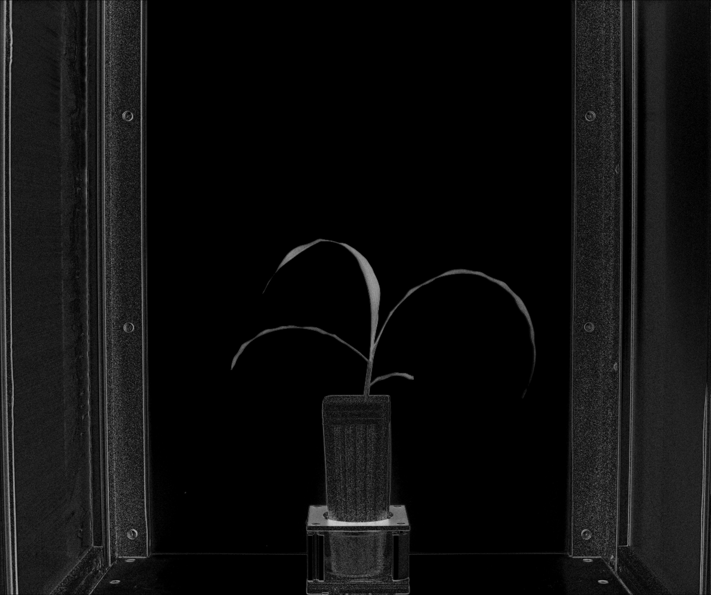

Next, the saturation channel is thresholded.
The threshold can be on either light or dark objects in the image (see more info on threshold function [here](binary_threshold.md)).

Tip: This step is often one that needs to be adjusted depending on the lighting and configurations of your camera system

```python
    # Threshold the Saturation image
    s_thresh = pcv.binary_threshold(s, 30, 255, 'light')
```

**Figure 3.** Thresholded saturation channel image (Figure 2). Remaining objects are in white.

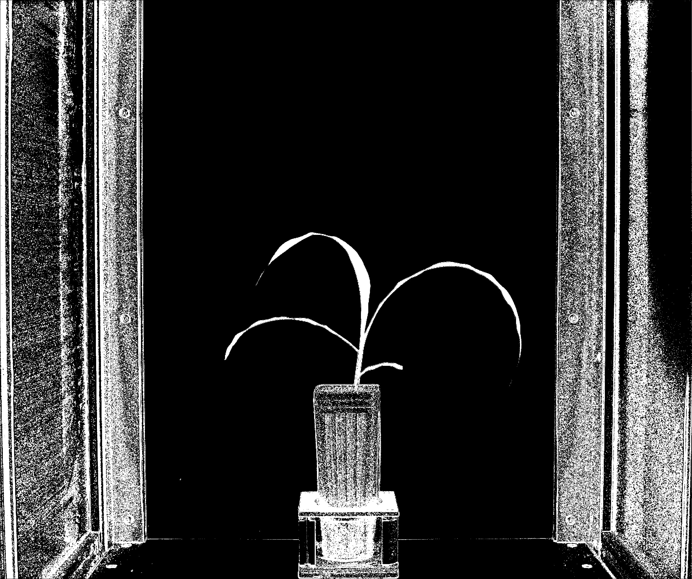

Again depending on the lighting, it will be possible to remove more/less background.
A median blur (more info [here](median_blur.md)) can be used to remove noise.

Tip: Fill and median blur type steps should be used as sparingly as possible. Depending on the plant type (esp. grasses with thin leaves that often twist) you can lose plant material with a median blur that is too harsh.

```python
    # Median Filter
    s_mblur = pcv.median_blur(s_thresh, 5)
    s_cnt = pcv.median_blur(s_thresh, 5)
```

**Figure 4.** Thresholded saturation channel image with median blur.

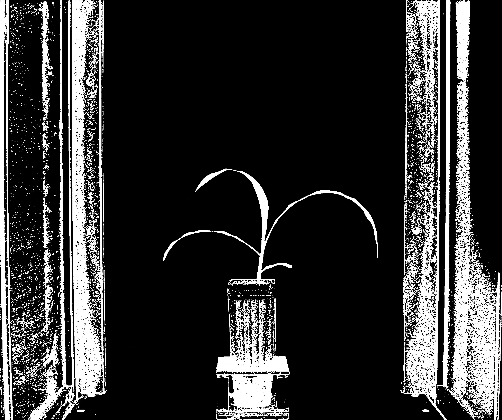

Here is where the pipeline branches.
The original image is used again to select the blue-yellow channel from LAB colorspace (more info on the function [here](rgb2lab.md)).
This image is again thresholded and there is an optional fill step that wasn't needed in this pipeline.

```python
    # Convert RGB to LAB and extract the Blue channel
    b = pcv.rgb2gray_lab(img, 'b')
    
    # Threshold the blue image
    b_thresh = pcv.threshold.binary(b, 129, 255, 'light')
    b_cnt = pcv.threshold.binary(b, 19, 255, 'light')
 
```

**Figure 5.** (Top) Blue-yellow channel from LAB colorspace from original image (Top). (Bottom) Thresholded blue-yellow channel image.

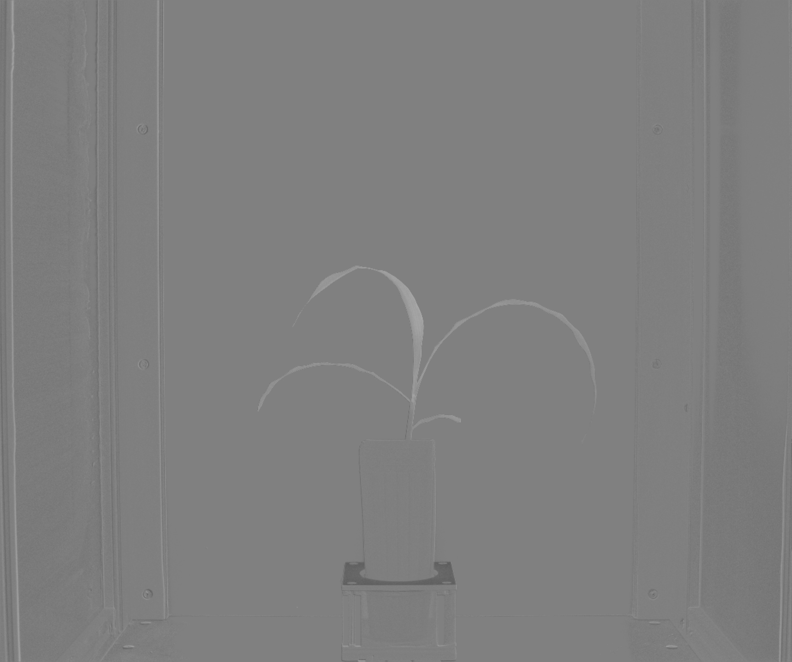

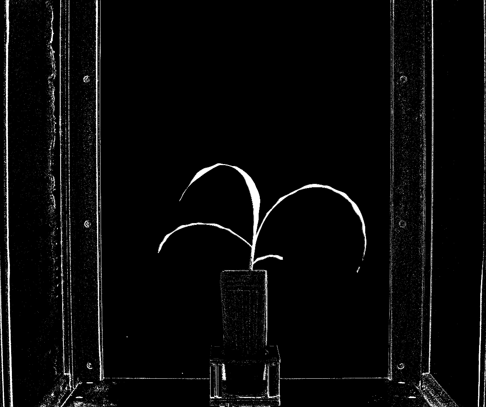

Join the binary images from Figure 4 and Figure 5 with the Logical And function (for more info on the Logical And function see [here](logical_and.md))

```python
    # Join the thresholded saturation and blue-yellow images
    bs = pcv.logical_and(s_mblur, b_cnt)
```

**Figure 6.** Joined binary images (Figure 4 and Figure 5).

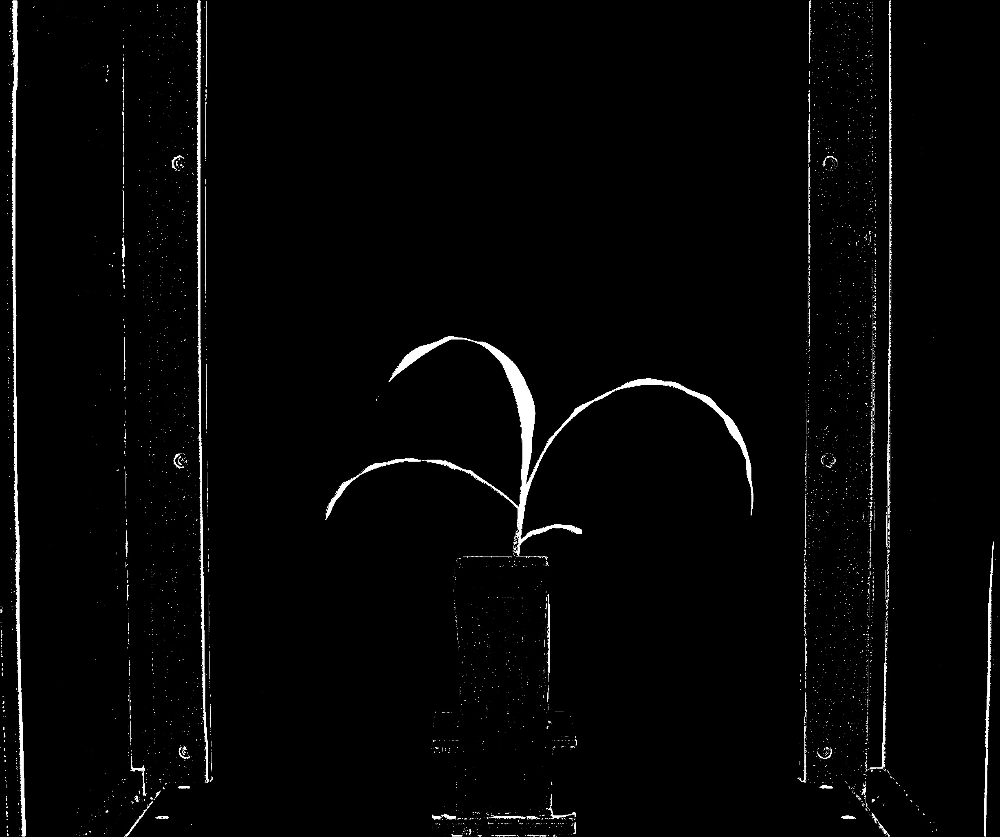

Next, apply the binary image (Figure 6) as an image mask over the original image (For more info on mask function see [here](apply_mask.md).
The point of this mask is really to exclude as much background with simple thresholding without leaving out plant material.

```python
    # Apply Mask (for vis images, mask_color=white)
    masked = pcv.apply_mask(img, bs, 'white')
```

**Figure 7.** Masked image with background removed.

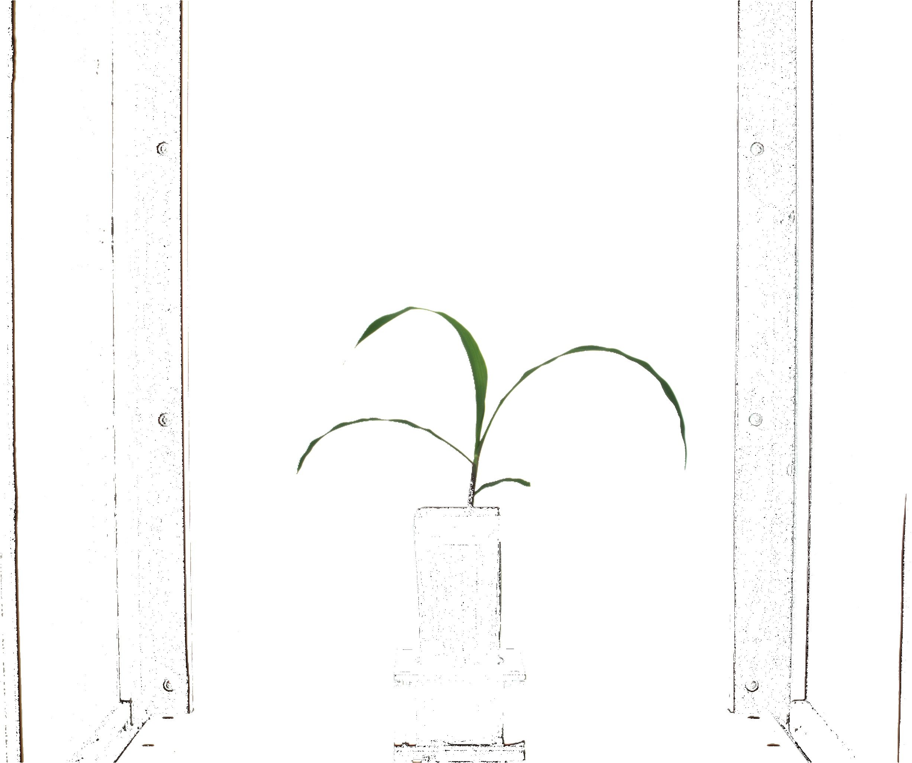

Now we need to identify the objects (called contours in OpenCV) within the image. 
For more information on this function see [here](find_objects.md)

```python
    # Identify objects
    id_objects,obj_hierarchy = pcv.find_objects(masked, bs)
```

**Figure 8.** Here the objects (purple) are identified from the image from Figure 10.
Even the spaces within an object are colored, but will have different hierarchy values.

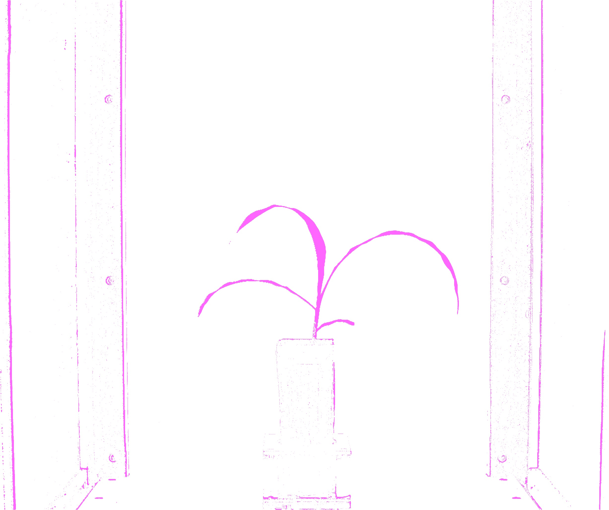

Next the region of interest is defined (this can be made on the fly, for more information 
see [here](roi_rectangle.md))

```python
    # Define ROI
    roi1, roi_hierarchy= pcv.roi.rectangle(600,450,-600,-700, img)
```

**Figure 9.** Region of interest drawn onto image. 

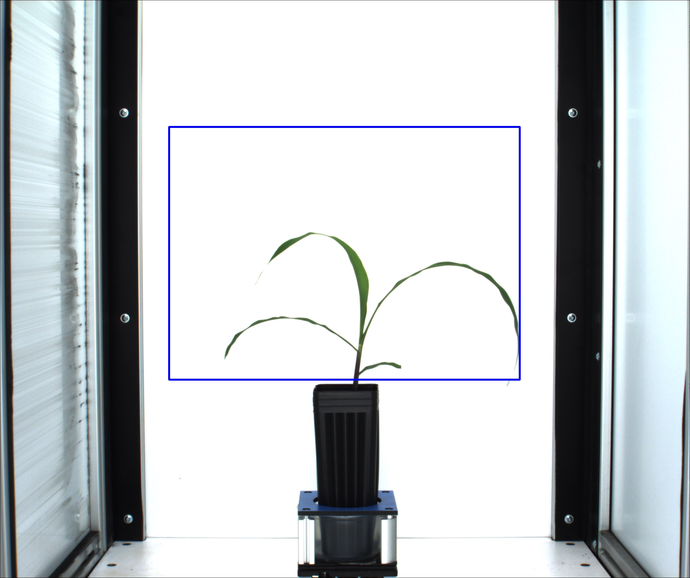

Once the region of interest is defined you can decide to keep all of the contained 
and overlapping with that region of interest or cut the objects to the shape of the region of interest.
For more information see [here](roi_objects.md).

```python
    # Decide which objects to keep
    roi_objects, hierarchy, kept_mask, obj_area = pcv.roi_objects(img,'partial',roi1,roi_hierarchy,id_objects,obj_hierarchy)
```

**Figure 10.** Kept objects (green) drawn onto image.

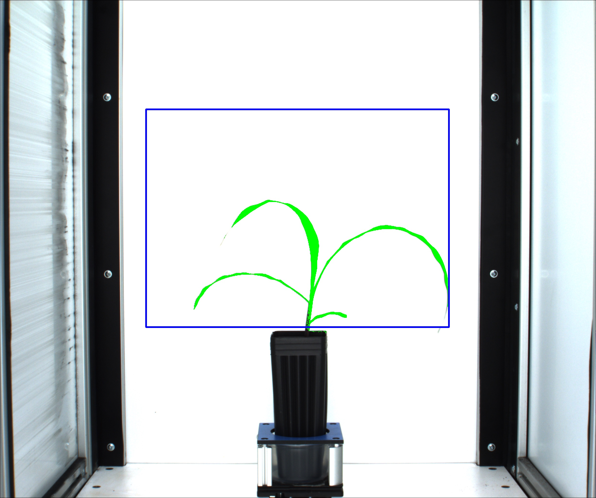

The isolated objects now should all be plant material. There, can however, 
be more than one object that makes up a plant, since sometimes leaves twist 
making them appear in images as seperate objects. Therefore, in order for 
shape analysis to perform properly the plant objects need to be combined into 
one object using the Combine Objects function (for more info see [here](object_composition.md)).

```python
    # Object combine kept objects
    obj, mask = pcv.object_composition(img, roi_objects, hierarchy)
```

**Figure 11.** Outline (blue) of combined objects on the image. 


The next step is to analyze the plant object for traits such as shape, or color.
For more info see the Shape Function [here](analyze_shape.md),
the Color Function [here](analyze_color.md),
and the Boundary tool function [here](analyze_bound_horizontal.md).

```python
############### Analysis ################  
  
    # Find shape properties, output shape image (optional)
    shape_header, shape_data, shape_img = pcv.analyze_object(img, obj, mask, args.outdir + '/' + filename)
    
    # Shape properties relative to user boundary line (optional)
    boundary_header, boundary_data, boundary_img1 = pcv.analyze_bound_horizontal(img, obj, mask, 1680, args.outdir + '/' + filename)
    
    # Determine color properties: Histograms, Color Slices and Pseudocolored Images, output color analyzed images (optional)
    color_header, color_data, color_img = pcv.analyze_color(img, kept_mask, 256, 'all', 'rgb', 'v', 'img', 300, args.outdir + '/' + filename)
    
    # Write shape and color data to results file
    result=open(args.result,"a")
    result.write('\t'.join(map(str,shape_header)))
    result.write("\n")
    result.write('\t'.join(map(str,shape_data)))
    result.write("\n")
    for row in shape_img:  
        result.write('\t'.join(map(str,row)))
        result.write("\n")
    result.write('\t'.join(map(str,color_header)))
    result.write("\n")
    result.write('\t'.join(map(str,color_data)))
    result.write("\n")
    for row in color_img:
        result.write('\t'.join(map(str,row)))
        result.write("\n")
    result.close()
  
```

**Figure 12.** Shape analysis output image.

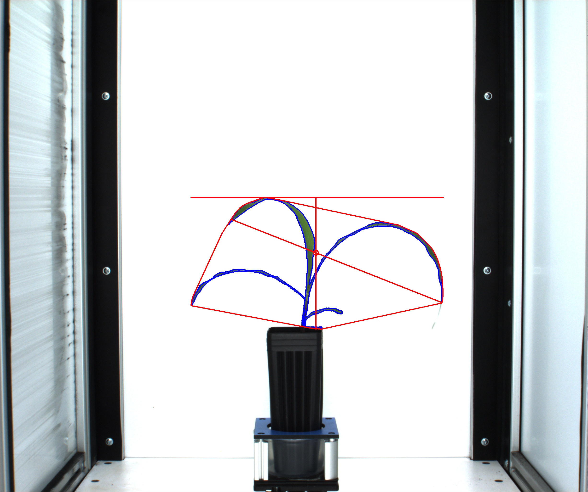

**Figure 13.** Boundary line output image.

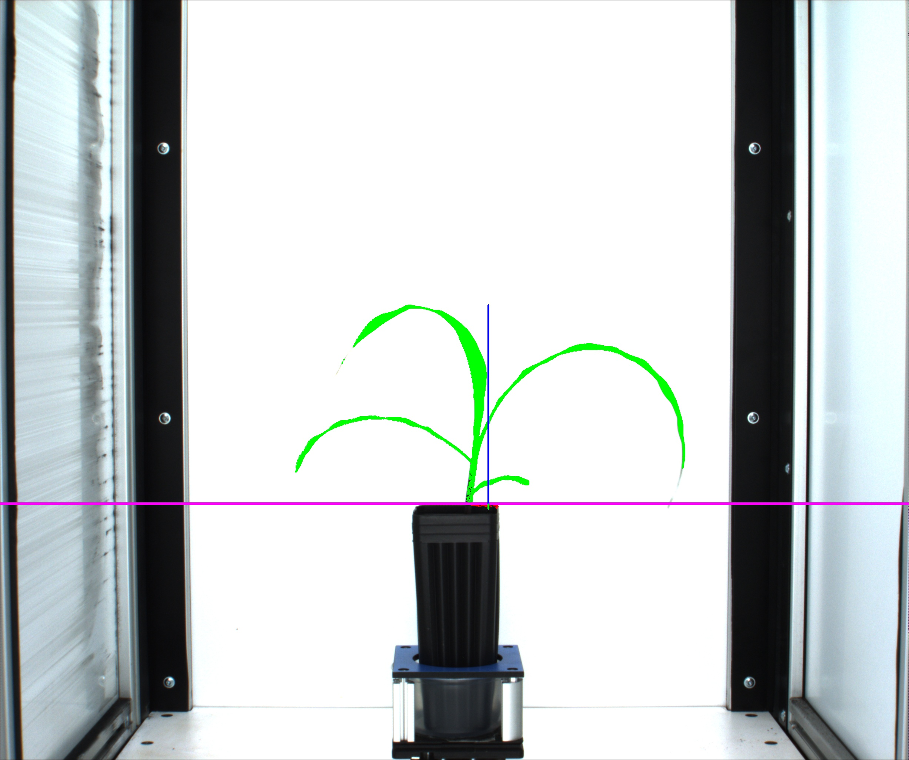

**Figure 14.** Pseudocolored image (based on value channel).

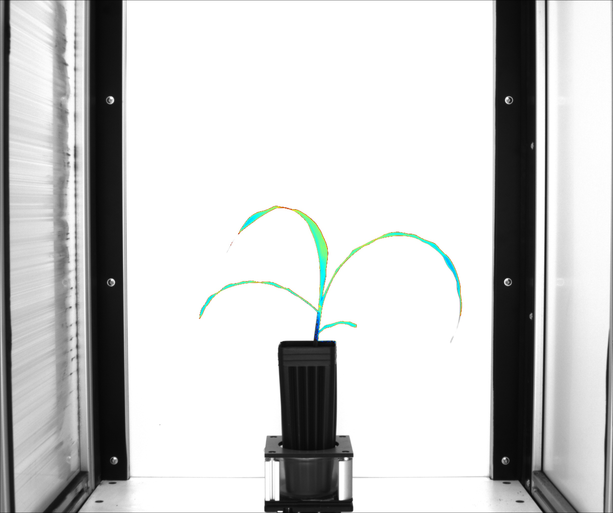

The next step is to get the matching NIR image and resize and place the VIS mask over it.
For more info see the get_nir Function [here](get_nir.md),
the resize function [here](resize.md),
the Crop and Position function [here](crop_position_mask.md).

```python
if args.coresult is not None:
    nirpath = pcv.get_nir(path,filename)
    nir, path1, filename1 = pcv.readimage(nirpath)
    nir2 = cv2.imread(nirpath,0)
  
nmask = pcv.resize(mask, 0.28,0.28)

newmask = pcv.crop_position_mask(nir,nmask,40,3,"top","right")
    
```

**Figure 15.** Resized image.

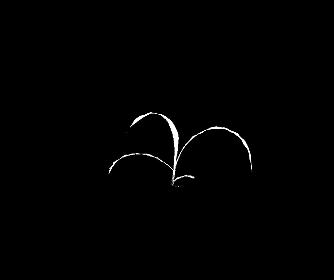

**Figure 16.** VIS mask on image.

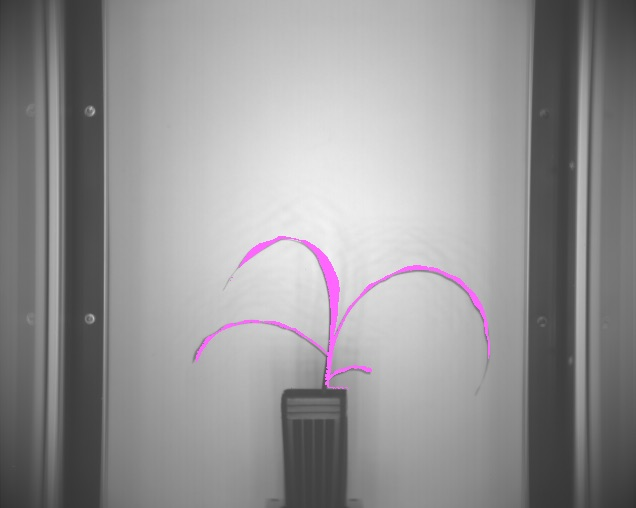

```python

    nir_objects, nir_hierarchy = pcv.find_objects(nir, newmask)

```

**Figure 17.** Find objects.


```python
    
    #combine objects
    nir_combined, nir_combinedmask = pcv.object_composition(nir, nir_objects, nir_hierarchy)

```

**Figure 18.** Combine objects.

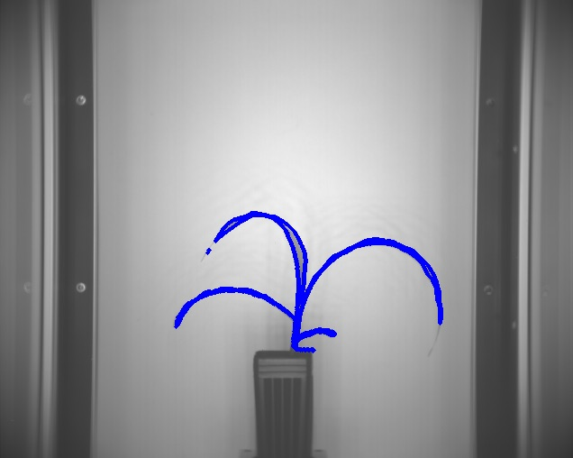

```python
    outfile1=False
    if args.writeimg==True:
        outfile1=args.outdir+"/"+filename1
      
    nhist_header, nhist_data, nir_imgs = pcv.analyze_nir_intensity(nir2, nir_combinedmask, 256, False, outfile1)
    nshape_header, nshape_data, nir_shape = pcv.analyze_object(nir2, nir_combined, nir_combinedmask, outfile1)

```

**Figure 19.** NIR signal histogram.

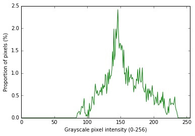

**Figure 20.** NIR shapes.

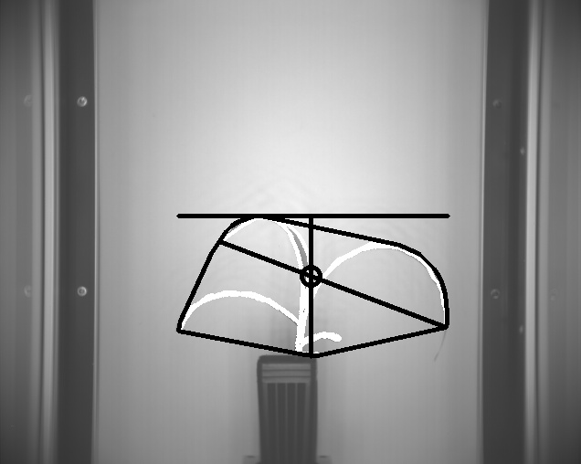

Write co-result data out to a file.

```python

    coresult=open(args.coresult,"a")
    coresult.write('\t'.join(map(str,nhist_header)))
    coresult.write("\n")
    coresult.write('\t'.join(map(str,nhist_data)))
    coresult.write("\n")
    for row in nir_imgs:
      coresult.write('\t'.join(map(str,row)))
      coresult.write("\n")
    coresult.write('\t'.join(map(str,nshape_header)))
    coresult.write("\n")
    coresult.write('\t'.join(map(str,nshape_data)))
    coresult.write("\n")
    coresult.write('\t'.join(map(str,nir_shape)))
    coresult.write("\n")
    coresult.close()
    
if __name__ == '__main__':
  main()
  
```

To deploy a pipeline over a full image set please see tutorial on 
Pipeline Parallelization [here](pipeline_parallel.md).