## Tutorial: VIS Image Pipeline

PlantCV is composed of modular functions that can be arranged (or rearranged) and adjusted quickly and easily.
Pipelines do not need to be linear (and often are not). Please see pipeline example below for more details.
Every function has a optional debug mode that prints out the resulting image. The debug has two modes, either 'plot' or print' if set to
'print' then the function prints the image out, if using a jupyter notebook, you would set debug to plot to have
the images plot images to the screen. Debug mode allows users to visualize and optimize each step on individual test images and small test sets before pipelines are deployed over whole data-sets.

**Workflow**

1.  Optimize pipeline on individual image in debug mode.
2.  Run pipeline on small test set (ideally that spans time and/or treatments).
3.  Re-optimize pipelines on 'problem images' after manual inspection of test set.
4.  Deploy optimized pipeline over test set using parallelization script.

**Running A Pipeline**

To run a VIS pipeline over a single VIS image there are two required inputs:

1.  **Image:** Images can be processed regardless of what type of VIS camera was used (High-throughput platform, digital camera, cell phone camera).
Image processing will work with adjustments if images are well lit and free of background that is similar in color to plant material.  
2.  **Output directory:** If debug mode is on output images from each step are produced, otherwise ~4 final output images are produced.

Optional inputs:  

*  **Result File** file to print results to
*  **Write Image Flag** flag to write out images, otherwise no result images are printed (to save time).
*  **Params:** parameter settings for debug and output directory for debug files
*  **Region of Interest:** The user can input their own binary region of interest or image mask (make sure it is the same size as your image or you will have problems).

Sample command to run a pipeline on a single image:  

*  Always test pipelines (preferably with -D flag set to plot or print) before running over a full image set

```
./pipelinename.py -i testimg.png -o ./output-images -r results.txt -w -D 'print'
```

### Walk Through A Sample Pipeline

#### Pipelines start by importing necessary packages, and by defining user inputs.

```python
#!/usr/bin/python
import sys, traceback
import cv2
import numpy as np
import argparse
import string
from plantcv import plantcv as pcv

### Parse command-line arguments
def options():
    parser = argparse.ArgumentParser(description="Imaging processing with opencv")
    parser.add_argument("-i", "--image", help="Input image file.", required=True)
    parser.add_argument("-o", "--outdir", help="Output directory for image files.", required=False)
    parser.add_argument("-r","--result", help="result file.", required= False )
    parser.add_argument("-w","--writeimg", help="write out images.", default=False)
    parser.add_argument("-D", "--debug", help="can be set to 'print' or 'none' (or 'plot' if in jupyter) prints intermediate images.", default=None)
    args = parser.parse_args()
    return args
```

#### Start of the Main/Customizable portion of the pipeline.

The image input by the user is read in. The device variable is just a counter so that each debug image is labeled in numerical order.

```python
### Main pipeline
def main():
    # Get options
    args = options()
    
    pcv.params.debug=args.debug
    pcv.params.debug_outdir=args.outdir
    
    # Read image
    img, path, filename = pcv.readimage(args.image)
    
    # Pipeline step
```

**Figure 1.** Original image.
This particular image was captured by a digital camera, just to show that PlantCV works on images not captured on a 
[high-throughput phenotyping system](http://www.danforthcenter.org/scientists-research/core-technologies/phenotyping) with idealized vis image capture conditions.


  
In some pipelines (especially ones captured with a high-throughput phenotyping systems, where background is predictable) we first threshold out background.
In this particular pipeline we do some premasking of the background. The goal is to remove as much background as possible without thresholding-out the plant.
In order to perform a binary threshold on an image you need to select one of the color channels H,S,V,L,A,B,R,G,B.
Here we convert the RGB image to HSV colorspace then extract the 's' or saturation channel (see more info [here](rgb2hsv.md)), any channel can be selected based on user need.
If some of the plant is missed or not visible then thresholded channels may be combined (a later step).

```python
        
    # Convert RGB to HSV and extract the Saturation channel
    s = pcv.rgb2gray_hsv(img, 's')
```

**Figure 2.** Saturation channel from original RGB image converted to HSV colorspace.

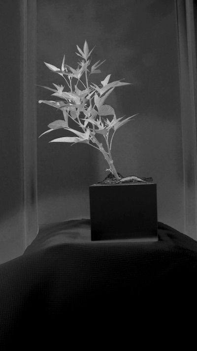

Next, the saturation channel is thresholded.
The threshold can be on either light or dark objects in the image (see more info on threshold function [here](binary_threshold.md)).

Tip: This step is often one that needs to be adjusted depending on the lighting and configurations of your camera system

```python
    # Threshold the Saturation image
    s_thresh = pcv.threshold.binary(s, 85, 255, 'light')
```

**Figure 3.** Thresholded saturation channel image (Figure 2). Remaining objects are in white.


Again depending on the lighting, it will be possible to remove more/less background.
A median blur (more info [here](median_blur.md)) can be used to remove noise.

Tip: Fill and median blur type steps should be used as sparingly as possible. Depending on the plant type (esp. grasses with thin leaves that often twist) you can lose plant material with a median blur that is too harsh.

```python
    # Median Filter
    s_mblur = pcv.median_blur(s_thresh, 5)
    s_cnt = pcv.median_blur(s_thresh, 5)
```

**Figure 4.** Thresholded saturation channel image with median blur.


Here is where the pipeline branches.
The original image is used again to select the blue-yellow channel from LAB colorspace (more info on the function [here](rgb2lab.md)).
This image is again thresholded and there is an optional fill step that wasn't needed in this pipeline.

```python
    # Convert RGB to LAB and extract the Blue channel
    b = pcv.rgb2gray_lab(img, 'b')
    
    # Threshold the blue image
    b_thresh = pcv.threshold.binary(b, 160, 255, 'light')
    b_cnt = pcv.threshold.binary(b, 160, 255, 'light')
    
    # Fill small objects
    b_fill = pcv.fill(b_thresh, 10)
```

**Figure 5.** (Top) Blue-yellow channel from LAB colorspace from original image (Top). (Bottom) Thresholded blue-yellow channel image.

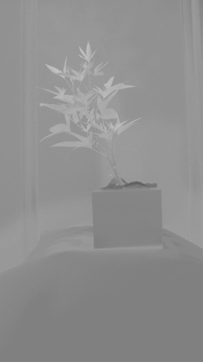

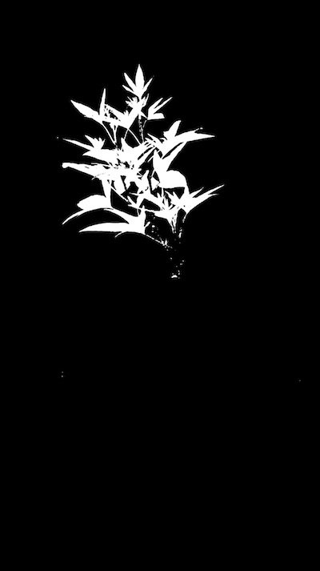

Join the binary images from Figure 4 and Figure 5 with the Logical Or function (for more info on the Logical Or function see [here](logical_or.md))

```python
    # Join the thresholded saturation and blue-yellow images
    bs = pcv.logical_or(s_mblur, b_cnt)
```

**Figure 6.** Joined binary images (Figure 4 and Figure 5).


Next, apply the binary image (Figure 6) as an image mask over the original image (For more info on mask function see [here](apply_mask.md).
The point of this mask is really to exclude as much background with simple thresholding without leaving out plant material.

```python
    # Apply Mask (for vis images, mask_color=white)
    masked = pcv.apply_mask(img, bs, 'white')
```

**Figure 7.** Masked image with background removed.

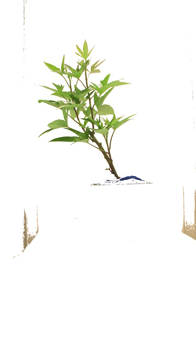

Now we'll focus on capturing the plant in the masked image from Figure 7.
The masked green-magenta and blue-yellow channels are extracted.
Then the two channels are thresholded to capture different portions of the plant and the three images are joined together.
The small objects are filled (for more info on the fill function see [here](fill.md)).
The resulting binary image is used to mask the masked image from Figure 7.

```python
    # Convert RGB to LAB and extract the Green-Magenta and Blue-Yellow channels
    masked_a = pcv.rgb2gray_lab(masked, 'a')
    masked_b = pcv.rgb2gray_lab(masked, 'b')
    
    # Threshold the green-magenta and blue images
    maskeda_thresh = pcv.threshold.binary(masked_a, 115, 255, 'dark')
    maskeda_thresh1 = pcv.threshold.binary(masked_a, 135, 255, 'light')
    maskedb_thresh = pcv.threshold.binary(masked_b, 128, 255, 'light')
    
    # Join the thresholded saturation and blue-yellow images (OR)
    ab1 = pcv.logical_or(maskeda_thresh, maskedb_thresh)
    ab = pcv.logical_or(maskeda_thresh1, ab1)
    ab_cnt = pcv.logical_or(maskeda_thresh1)
    
    # Fill small objects
    ab_fill = pcv.fill(ab, 200)
    
    # Apply mask (for vis images, mask_color=white)
    masked2 = pcv.apply_mask(masked, ab_fill, 'white')
```

The sample image used had very green leaves, but often (especially with stress treatments) 
there are yellowing or redish leaves or regions of necrosis. The different thresholded 
channels capture different regions of the plant, then are combined into a mask for the image 
that was previously masked (Figure 7).

**Figure 8.** RGB to LAB conversion. (Top) The green-magenta "a" channel image. (Bottom) The blue-yellow "b" channel image.


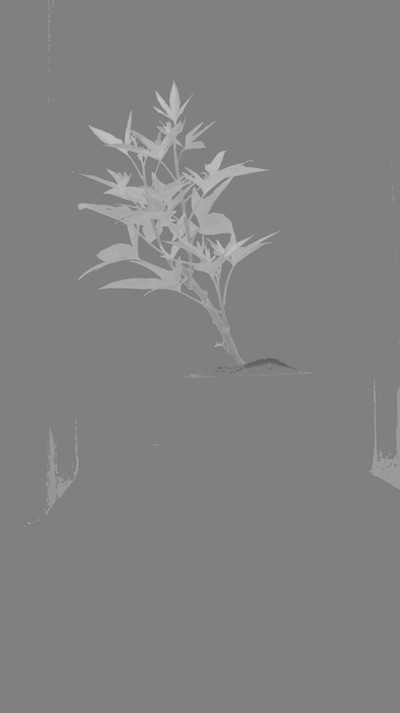

**Figure 9.** Thresholded LAB channel images. (Top) "dark" threshold 115. (Middle) "light" threshold 135. (Bottom) "light" threshold 128.

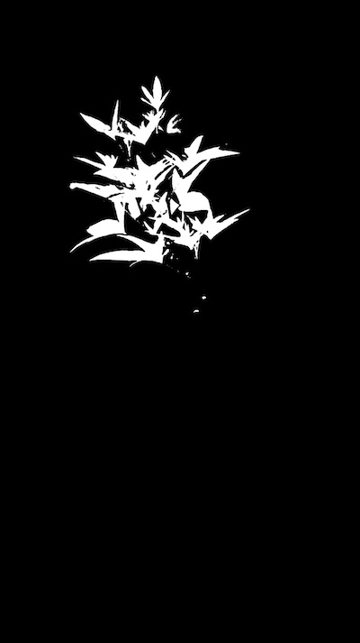

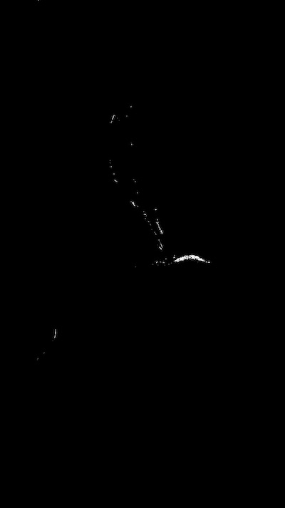


**Figure 9.** Combined thresholded images.

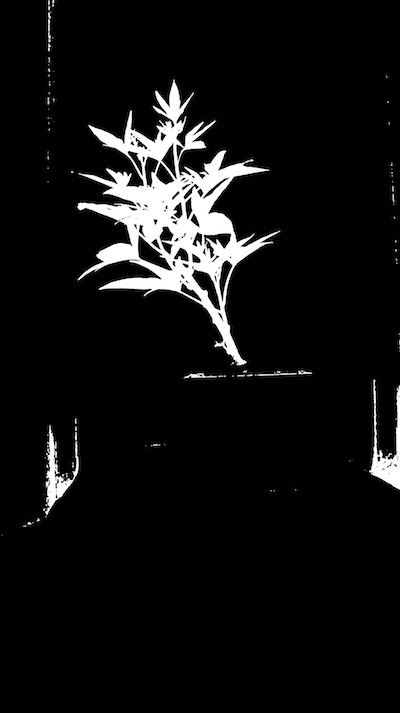


 **Figure 10.** Fill in small objects. (Top) Image with objects < 200 px filled. (Bottom) Masked image.
 


Now we need to identify the objects (called contours in OpenCV) within the image. 
For more information on this function see [here](find_objects.md)

```python
    # Identify objects
    id_objects, obj_hierarchy = pcv.find_objects(masked2, ab_fill)
```

**Figure 11.** Here the objects (purple) are identified from the image from Figure 10.
Even the spaces within an object are colored, but will have different hierarchy values.

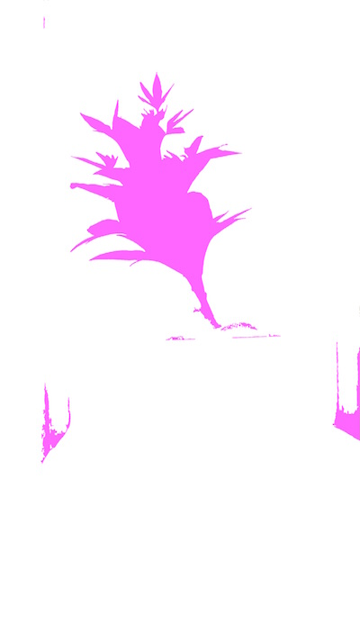

Next the region of interest is defined (this can be made on the fly, for more information 
see [here](roi_rectangle.md))

```python
    # Define ROI
    roi1, roi_hierarchy= pcv.roi.rectangle(x=100, y=100, h=200, w=200, img=masked2)
```

**Figure 12.** Region of interest drawn onto image. 

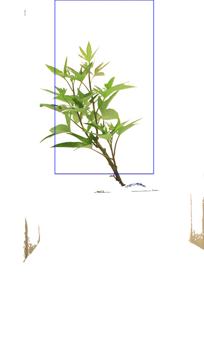

Once the region of interest is defined you can decide to keep all of the contained 
and overlapping with that region of interest or cut the objects to the shape of the region of interest.
For more information see [here](roi_objects.md).

```python
    # Decide which objects to keep
    roi_objects, hierarchy3, kept_mask, obj_area = pcv.roi_objects(img, 'partial', roi1, roi_hierarchy, id_objects, obj_hierarchy)
```

**Figure 13.** Kept objects (green) drawn onto image.

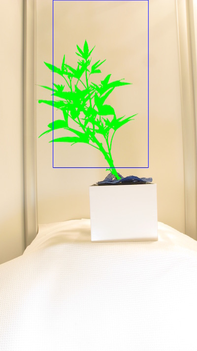

The isolated objects now should all be plant material. There, can however, 
be more than one object that makes up a plant, since sometimes leaves twist 
making them appear in images as separate objects. Therefore, in order for
shape analysis to perform properly the plant objects need to be combined into 
one object using the Combine Objects function (for more info see [here](object_composition.md)).

```python
    # Object combine kept objects
    obj, mask = pcv.object_composition(img, roi_objects, hierarchy3)
```

**Figure 14.** Outline (blue) of combined objects on the image. 

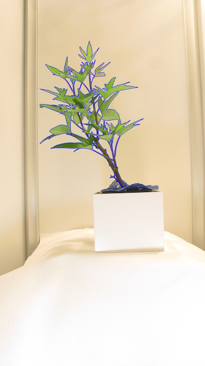

The next step is to analyze the plant object for traits such as shape, or color.
For more info see the Shape Function [here](analyze_shape.md),
the Color Function [here](analyze_color.md),
and the Boundary tool function [here](analyze_bound_horizontal.md).

```python
############### Analysis ################
  
    outfile=False
    if args.writeimg==True:
        outfile=args.outdir+"/"+filename
  
    # Find shape properties, output shape image (optional)
    shape_header, shape_data, shape_img = pcv.analyze_object(img, obj, mask, args.outdir + '/' + filename)
    
    # Shape properties relative to user boundary line (optional)
    boundary_header, boundary_data, boundary_img1 = pcv.analyze_bound_horizontal(img, obj, mask, 1680, args.outdir + '/' + filename)
    
    # Determine color properties: Histograms, Color Slices and Pseudocolored Images, output color analyzed images (optional)
    color_header, color_data, color_img = pcv.analyze_color(img, kept_mask, 256, 'all', 'v', 'img', 300, args.outdir + '/' + filename)
    
    # Write shape and color data to results file
    result=open(args.result,"a")
    result.write('\t'.join(map(str,shape_header)))
    result.write("\n")
    result.write('\t'.join(map(str,shape_data)))
    result.write("\n")
    for row in shape_img:  
        result.write('\t'.join(map(str,row)))
        result.write("\n")
    result.write('\t'.join(map(str,color_header)))
    result.write("\n")
    result.write('\t'.join(map(str,color_data)))
    result.write("\n")
    for row in color_img:
        result.write('\t'.join(map(str,row)))
        result.write("\n")
    result.close()
  
if __name__ == '__main__':
    main()
```

**Figure 15.** Shape analysis output image.

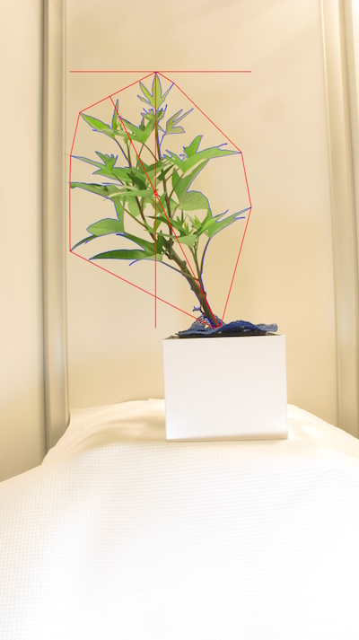

**Figure 16.** Boundary line output image.

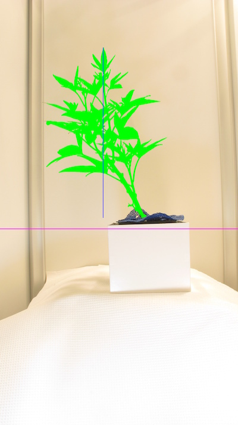

**Figure 17.** Pseudocolored image (based on value channel).

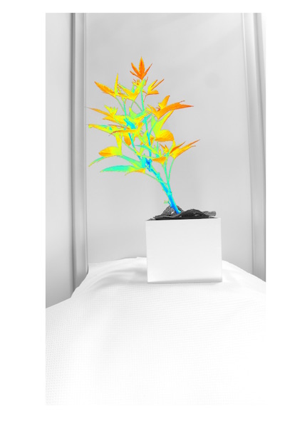

**Figure 18.** Histogram of color values for each plant pixel.

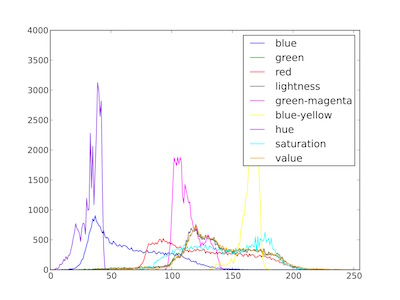

### Additional examples

To demonstrate the importance of camera settings on pipeline construction, 
here are different species of plants captured with the same imaging setup 
(digital camera) and processed with the same imaging pipeline as above (no settings changed).

**Figure 19.** Output images from Cassava trait analysis. (From top to bottom) Original image, shape output image, boundary line output image, pseudocolored image (based on value channel), histogram of color values for each plant pixel.

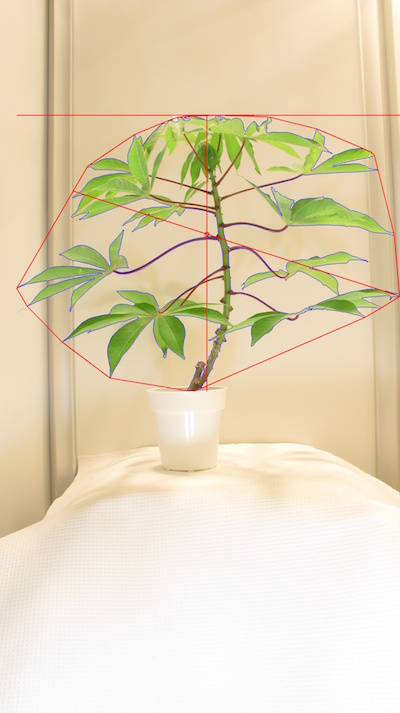

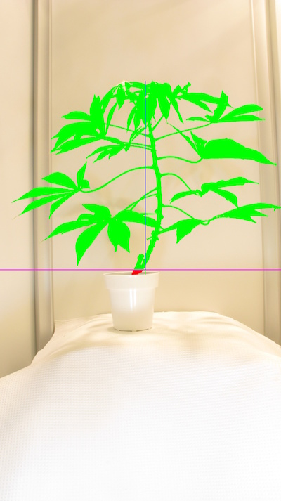

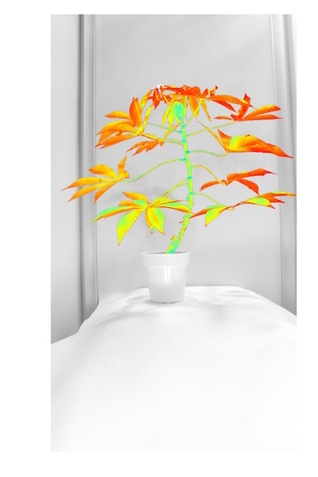

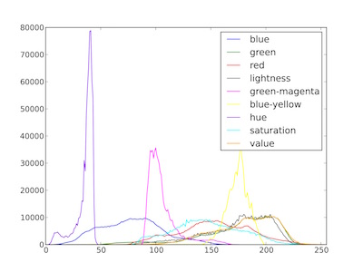

**Figure 20.** Output images from Tomato trait analysis. (From top to bottom) Original image, shape output image, boundary line output image, pseudocolored image (based on value channel), histogram of color values for each plant pixel.

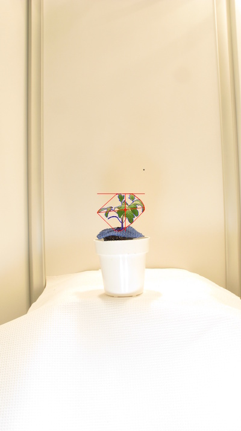


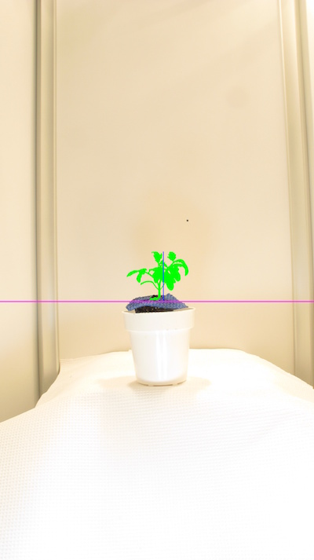

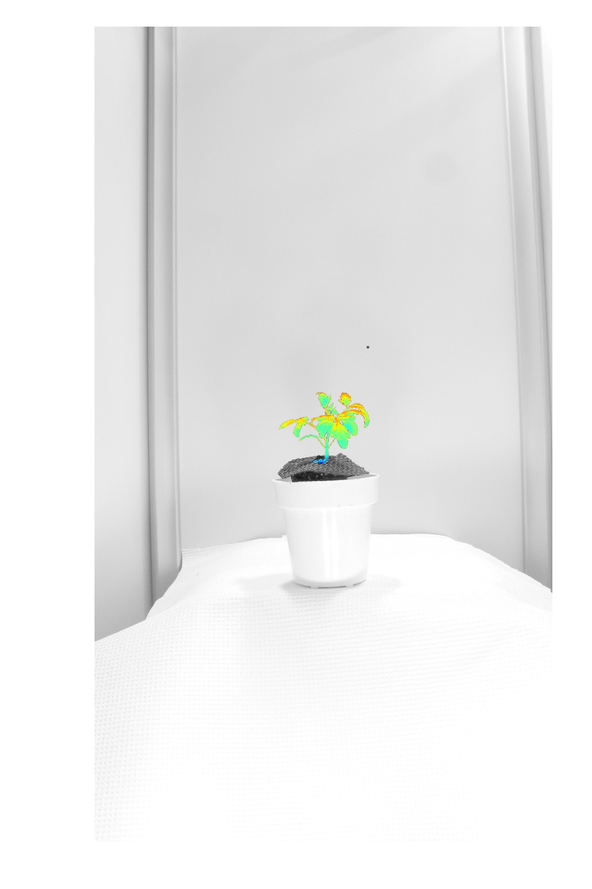

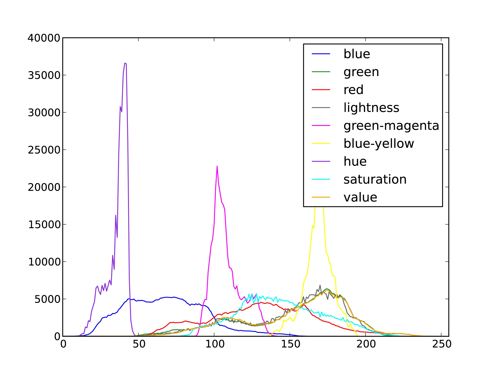


To deploy a pipeline over a full image set please see tutorial on 
Pipeline Parallelization [here](pipeline_parallel.md).
