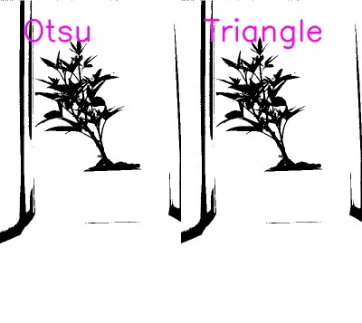

## Visualize All Auto-Thresholding Methods

This is a plotting method used to represent various auto-thresholding methods available in PlantCV. [triangle](triangle_threshold.md) and [Otsu](otsu_threshold.md).

**plantcv.visualize.auto_threshold_methods**(*gray_img, grid_img=True, object_type="light"*)

**returns** labeled_imgs

- **Parameters:**
    - gray_img - Grayscale image data
    - grid_img - Whether or not to compile masks into a single plot
    - object_type - "light" or "dark" (default: "light"). If object is lighter than the background then standard
    thresholding is done. If object is darker than the background then inverse thresholding is done.
- **Context:**
    - This function returns a list of the labeled binary masks that get created. The list needs to be subset in order to further
    manipulate the labeled images.
    - All auto threshold functions operate under default parameters (e.g. `xstep=1` in `pcv.threshold.triangle()`) apart from the
    user defined `object_type`.
- **Example use:**
    - Below

**Original image**


```python

from plantcv import plantcv as pcv
pcv.params.debug = "plot"

# Our input image was relatively large so increase global parameters
pcv.params.text_size = 2.2       # Default = .55
pcv.params.text_thickness = 4    # Default = 2

# Visualize all auto threshold methods  
labeled_imgs = pcv.visualize.auto_threshold_methods(gray_img=gray_img, grid_img=True, object_type="light")

```

**Grid Image:**




**Source Code:** [Here](https://github.com/danforthcenter/plantcv/blob/main/plantcv/plantcv/visualize/auto_threshold_methods.py)
