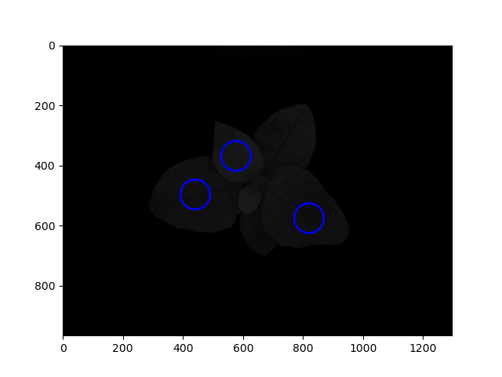
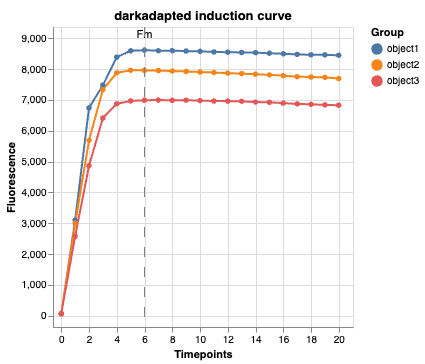

## Plot chlorophyll fluorescence induction curves

Creates a chart of chlorophyll fluorescence induction curves from a PSII_Data instance. The photosynthesis subpackage is
dependent on a PSII_Data instance file structure as created by `photosynthesis.read_cropreporter`. Plots the mean level
of fluorescence per object/label per frame/timepoint. The PSII_Data Fm and Fm' frames are labeled and the chart can be used
to decide whether to use `auto_fm` in [pcv.analyze.yii](analyze_yii.md) and [pcv.analyze.npq](analyze_npq.md).

**plantcv.visualize.chlorophyll_fluorescence**(*ps_da, labeled_mask, n_labels=1, label="object"*)

**returns** chlorophyll fluorescence induction curve chart

- **Parameters:**
    - ps_da - photosynthesis xarray DataArray ("ojip_light" or "ojip_dark")
    - labeled_mask - Labeled mask of objects (32-bit).
    - n_labels - Total number expected individual objects (default = 1).
    - label - optional label parameter, modifies the prefix of the group plotting label
- **Context:**
    - Used to visualize chlorophyll florescence induction curves.
- **Example use:**
    - [Use In PSII Tutorial](tutorials/psII_tutorial.md)

**Example image with labels marking three leaves**



```python
from plantcv import plantcv as pcv

# Set global debug behavior to None (default), "print" (to file), 
# or "plot" (Jupyter Notebooks or X11)
pcv.params.debug = "plot"

chart = pcv.visualize.chlorophyll_fluorescence(ps_da=ps.ojip_dark, labeled_mask=labeled_mask, n_labels=3, label="object")

```

**Chlorophyll fluorescence induction curve chart**



**Source Code:** [Here](https://github.com/danforthcenter/plantcv/blob/master/plantcv/plantcv/visualize/chlorophyll_fluorescence.py)
