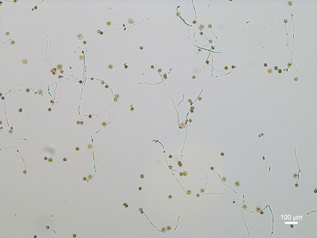
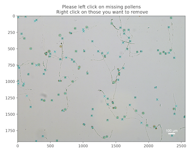
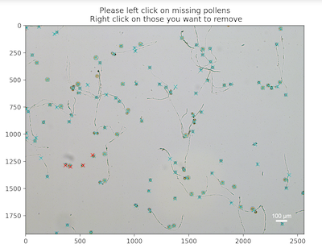

## Click and count objects (developing)

`ClickCount` is a class that allows user interactive to count objects in images.

*class* **plantcv.visualize.ClickCount**(*img*, *figsize*=(12, 6))
- To initialize a `ClickCount` class object, the only required input variable is `img`.
- Another optional input is the desired figure size `figsize`, by default `figsize=(12,6)`.

### Attributes
**img**: input image.

**counts**: a dictionary of count for every class.

### Methods
**import_coords(*coords*, *label*="total")**
- Import available coordinated for a specific class (if applicable).
- **Parameters:**
  - coords - a list of available coordintes.
  - label - class label for imported coordinates. By default `label="total`.

**view(*label*="total", *color*="c", *view_all*=False)**
- View marked image, and update markers if needed.
- **Parameters**:
  - label - class label to show on the marked image. By default `label="total`.
  - color - desired color to show the class. By default `color="c"`.
  - view_all - a flag indicating whether to show markers for all classes or not. 

- **Example use:**
    - Below
- **Note**: used in Jupyter notebook.
  
**Input image**



**Mask of automated detected objects**
Note: for how to get this mask, refer to function `pcv.detect_descs`.


```python
# include the line of code below to allow interactive activities
%matplotlib notebook

from plantcv import plantcv as pcv
# initialization
counter = pcv.visualize.ClickCount(img)
# import coordinates (if available)
counter.import_coords(coords, label="total")
# view "total" class
counter.view(label="total", color="c", view_all=True)
# view "c1" class
counter.view(label="c1", color="r", view_all=True)
```

**View markers for `total` class**



(When interactivity is enabled, you can left click to add markers for the class, or right click to remove markers)

**View markers for `c1` class**


**Source Code:** [Here](https://github.com/danforthcenter/plantcv/blob/master/plantcv/plantcv/visualize/click_count.py)
