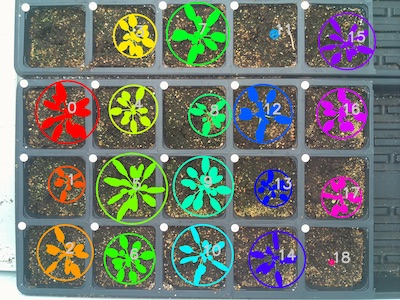
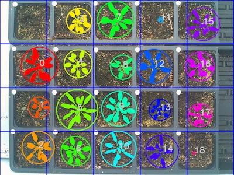

## Plot Image With Clustering Information 

This is a plotting method used to represent the way in which contours get clustered together into objects from [pcv.cluster_contours](cluster_contours.md).

**plantcv.visualize.clustered_contours**(*img, grouped_contour_indices, roi_objects, roi_obj_hierarchy, nrow=1, ncol=1, bounding=True*)

**returns** clustered_image

- **Parameters:**
    - img - RGB or grayscale image data for plotting.
    - grouped_contour_indices - Contour indices for which groups contours belong to. Output from [pcv.cluster_contour](cluster_contours.md)
    - roi_objects - object contours in an image that are needed to be clustered.
    - roi_obj_hierarchy - object hierarchy
    - nrow - Optional row grid lines to get drawn (default nrow=1). If `nrow` is unchanged, grid lines don't get drawn. 
    - ncol - Optional column grid lines to get drawn (default ncol=1). If `ncol` is unchanged, grid lines don't get drawn. 
    - bounding - Optional circles to bound the individual clusters (default bounding=True)
- **Context:**
    - This function was written to allow users to debug [pcv.cluster_contours](cluster_contours.md) and make sure that contours from the same 
    plant are getting grouped together. 
- **Example use:**
    - Below

**Original image**


```python

from plantcv import plantcv as pcv

# Our input image was relatively large so increase global parameters 
pcv.params.text_size = 3 # Default = .55
pcv.params.text_thickness = 10 # Default = 2
pcv.params.line_thickness = 10 # Default = 5

# Create a figure using output from pcv.cluster_contours 
clustered_image = pcv.visualize.clustered_contours(img=img, grouped_contour_indices=cnt_i, 
                                                   roi_objects=roi_obj,
                                                   roi_obj_hierarchy=hier, bounding=True)

# Create a figure using output from pcv.cluster_contours with a grid
clustered_image = pcv.visualize.clustered_contours(img=img, grouped_contour_indices=cnt_i, 
                                                   roi_objects=roi_obj,
                                                   roi_obj_hierarchy=hier,
                                                   nrow=4, ncol=6, bounding=True)
                                       
```

**Clustered Image:** 



**Clustered Image with Grid:** 



**Source Code:** [Here](https://github.com/danforthcenter/plantcv/blob/master/plantcv/plantcv/visualize/clustered_contours.py)
