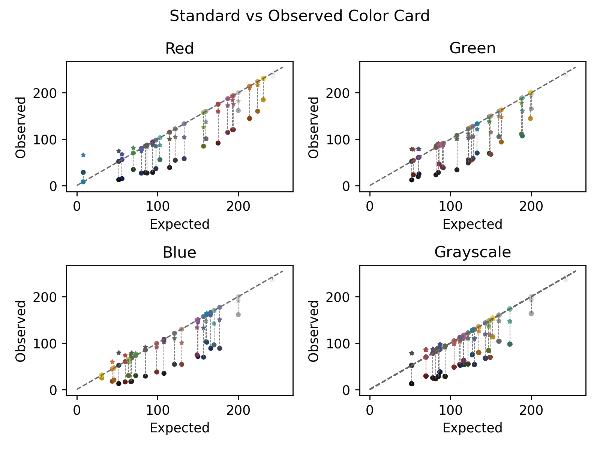

## Color Chip Comparison

This function makes a plot comparing observed versus expected values from 1 or more color cards against a standard color card matrix via a "greenness rank". The greenness rank is useful in checking color card quality. The ninth (red) color chip is known to fade most quickly and the proportion of green light that it reflects can vary dramatically as the color card ages.

**plantcv.visualize.color_chip_comparison**(*std_matrix, \*\*kwargs*)

**returns** plot, a altair.vegalite.v5.api.VConcatChart object

- **Parameters:**
    - std_matrix       - A numpy.ndarray as returned from [`pcv.transform.std_color_matrix`](std_color_matrix.md).
	- \*\*kwargs       - A list of numpy.ndarrays as returned from [`pcv.transform.get_color_matrix`](get_color_matrix.md)

- **Context:**
    - The aim of this visualization is to help evaluate the condition of a color card or set of color cards.


- **Example use:**
    - Below

**Dataset images:**


```python

from plantcv import plantcv as pcv

fig, axs = pcv.visualize.color_correction_plot(colmat, stdmat, ccmat)

```

**Pixel scatter visualizations:**




**Source Code:** [Here](https://github.com/danforthcenter/plantcv/blob/master/plantcv/plantcv/visualize/color_correction_scatter.py)
