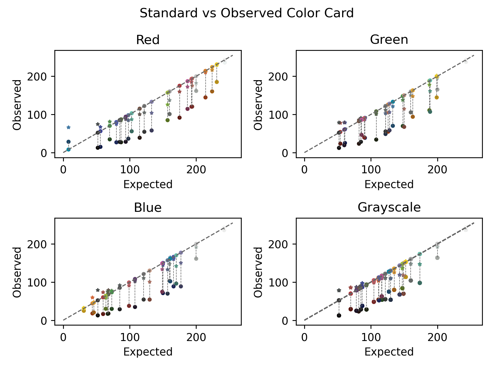

## Color correction scatter plot

This function plots 4 panels of 2D scatter plot visualizations showing RGB and grayscale values of an input image, the expected color card, and optionally a color corrected image. The horizontal and vertical coordinates are defined by the intensity of the pixels in the specified channels. The color of each dot is given by the original RGB color of the image, ideal color card, or corrected image.

**plantcv.visualize.color_correction_plot**(*color_matrix, std_matrix, corrected_matrix=None*)

**returns** fig, axs

- **Parameters:**
	- color_matrix     - A tuple of numpy.ndarrays, as returned from [`pcv.transform.get_color_matrix`](get_color_matrix.md).
	- std_matrix       - A numpy.ndarray as returned from [`pcv.transform.std_color_matrix`](std_color_matrix.md).
	- corrected_matrix - An optional tuple of numpy.ndarrays, as returned from [`pcv.transform.get_color_matrix`](get_color_matrix.md) used on a color corrected image.

- **Context:**
    - The aim of this visualization is to help evaluate the condition of a color card, input image, and color correction. Generally after color correction an image will look better but it may be useful to check the residuals shown in this plot between observed and expected values.


- **Example use:**
    - Below

**Dataset images:**


```python

from plantcv import plantcv as pcv

fig, axs = pcv.visualize.color_correction_plot(colmat, stdmat, ccmat)

```

**Color correction scatter visualizations:**




**Source Code:** [Here](https://github.com/danforthcenter/plantcv/blob/master/plantcv/plantcv/visualize/color_correction_scatter.py)
