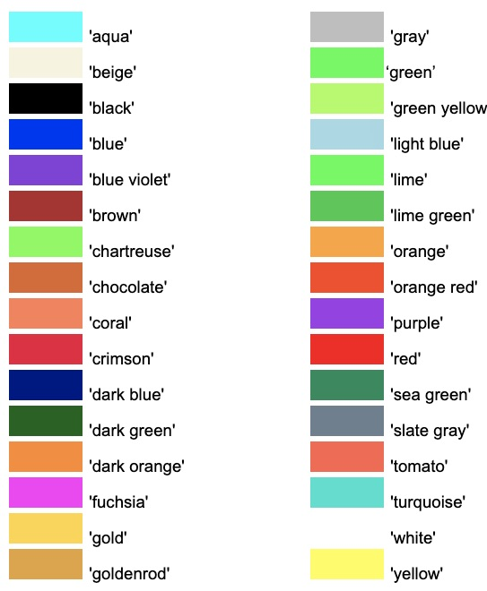
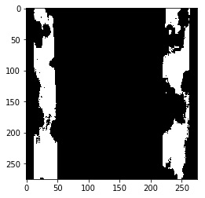
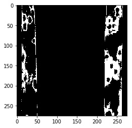
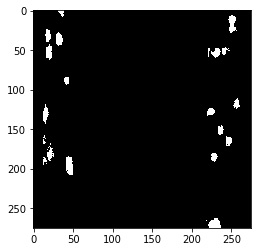
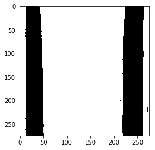
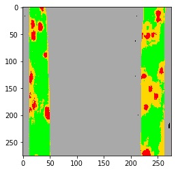

## Plot Classes 

This is a plotting method used to color masks.

**plantcv.visualize.colorize_masks**(*masks, colors*)

**returns** colored_img

- **Parameters:**
    - masks - A list of masks to plot
    - colors - A list of colors used to plot the given classes. Users can provide a list of strings from the 36 colors listed below, or list tuples.
- **Context:**
    - This function was written to allow users to plot masks returned by [naive bayes multiclass](naive_bayes_multiclass.md) but can be used with any mask. 
    The number of masks much match the number of colors. 
- **Example use:**
    - [Use In Machine Learning Tutorial](tutorials/machine_learning_tutorial.md)

**Named Colors**



**Original image**




```python

from plantcv import plantcv as pcv

# Run naive bayes multiclass and save a list of masks 
mask = pcv.naive_bayes_classifier(img, pdf_file="machine_learning.txt")

# Plot each class with it's own color 
plotted = pcv.visualize.colorize_masks(masks=[mask['plant'], mask['pustule'], mask['background'], mask['chlorosis']], 
                                       colors=['green', 'red', 'gray', 'gold'])
                                       
```

**Masks:** (from top to bottom) plant, chlorosis, pustule, background










**Plot with Colored Masks**



**Source Code:** [Here](https://github.com/danforthcenter/plantcv/blob/master/plantcv/plantcv/visualize/colorize_masks.py)
