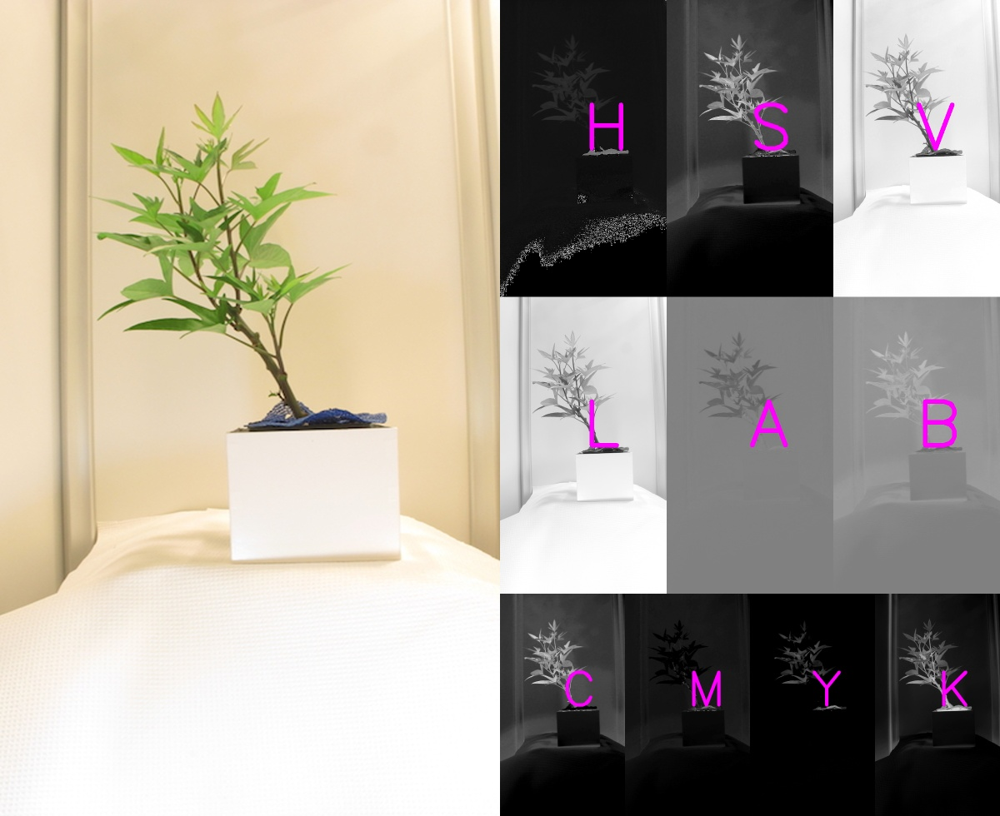

## Visualize Potential Colorspaces

This is a plotting method used to examine all potential colorspaces from available PlantCV functions.

**plantcv.visualize.colorspaces**(*rgb_img, original_img=True*)

**returns** plotting_img

- **Parameters:**
    - rgb_img - RGB image data, the original image for analysis.
    - original_img - Whether or not to include the original image the the debugging plot (default original_img=True)

- **Example use:**
    - Below

**Original image**


```python

from plantcv import plantcv as pcv

# Examine all colorspaces at one glance
colorspace_img = pcv.visualize.colorspaces(rgb_img=img)

```

**Ouput**



**Source Code:** [Here](https://github.com/danforthcenter/plantcv/blob/main/plantcv/plantcv/visualize/colorspaces.py)
