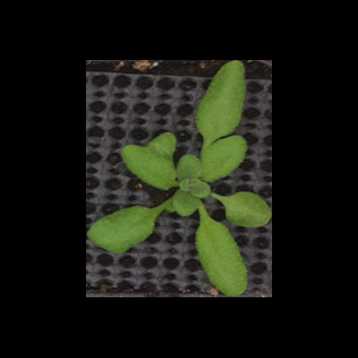
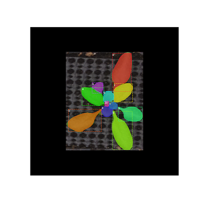
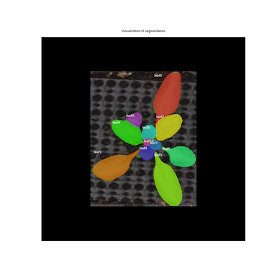
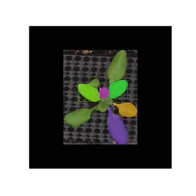

## Display Instances

This function displays different object intances in different colors on top of the original image.

**plantcv.visualize.display_instances**(*img, masks, figsize=(16, 16), title="", ax=None, colors=None, captions=None, show_bbox=True*)
**returns** masked_img, colors

- **Parameters:**
    - img        - (required, ndarray)input image
    - masks      - (required, ndarray) instance masks represented by a 3-d array, the 3rd dimension represents the number of insatnces to show.
    - figsize    - (optional, tuple) the size of the generated figure
    - title      - (optional, str) the title of the figure
    - ax         - (optional, matplotlib.axes._subplots.AxesSubplot) the axis to plot on. If no axis is passed, create one and automatically call show())
    - colors     - (optional, list of tuples, every value should be in the range of [0.0,1.0]) a list of colors to use with each object. If no value is passed, a set of random colors would be used
    - captions   - (optional, str) a list of strings to use as captions for each object. If no list of captions is provided, show the local index of the instance
    - show_bbox  - (optional, bool) indicator of whether showing the bounding-box

- **Context:**
    - Used to display different segmented instances on top of the original image. 
- **Example use:**
    - Below

**Original image: RGB image**



**masks: 10 different segmentation masks represent for different leaves**


```python

from plantcv import plantcv as pcv

masked_img,colors = pcv.visualize.display_instances(img, masks, figsize=(10, 10), title="", ax=None, colors=None, captions=None, show_bbox=True)

# option to add customized captions and/or customized figure title and/or not showing the bounding box
captions = ["leaf{}".format(i) for i in range(masks.shape[2])]
_,_ = pcv.visualize.display_instances(img, masks, figsize=(16, 16), title="Visualization of segmentation", ax=None, colors=None, captions=captions, show_bbox=False)

# the number of instances to display depends on the number of input masks
# the colors can also be customized 
masks_reduced = masks[:,:,2:7],
colors = [(0.0,1.0,0.2),(0.4,0.0,1.0),(0.5,1.0,0.0),(1.0,0.6,0.0),(0.9,0.0,1.0)]
_,_= pcv.visualize.display_instances(img, masks_reduced, figsize=(16, 16), title="", ax=None, colors=colors, captions=None, show_bbox=True)

```

**Blended Image**




**Source Code:** [Here](https://github.com/danforthcenter/plantcv/blob/master/plantcv/plantcv/visualize/display_instances.py)
