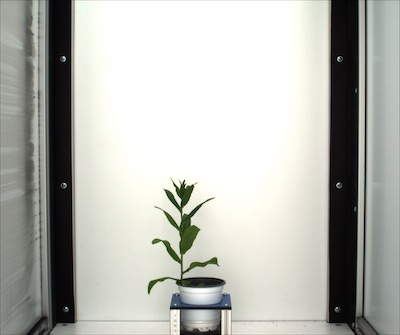
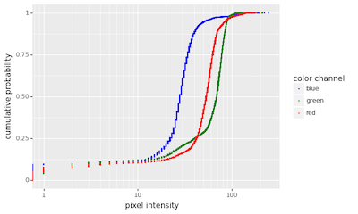
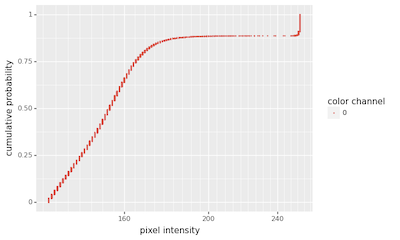
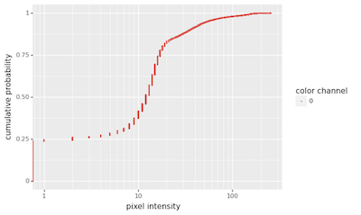

## Visualize Empirical Cumulative Distribution Function

This is a visualization method used to examine the distribution of pixel intensities. It is an alternative to histogram 
visualization.

**plantcv.visualize.ecdf.pix_intensity**(*img, mask=None, title=None*)
**returns** fig_ecdf

- **Parameters:**
    - img - Image data which is numpy.ndarray, the original image for analysis.
    - mask - Binary mask made from selected contours (default mask=None).
    - title - The title for the ecdf plot (default title=None) 
    
**Context:**
- Examine the cumulative distribution of pixel intensities of a given image. This can be used as an alternative 
  to histogram visualization.
- The y-axis presents the cumulative probability (range: [0,1]).  
- The x-axis presents the pixel intensity in common log-scale (logarithm with base 10)

- **Example use:**
    - Below
  
**Visible image**

      
**Grayscale image**


**Binary mask**


```python
from plantcv import plantcv as pcv
pcv.params.debug = "plot"

# ecdf for pixel intensities of visible image
fig_ecdf_rgb = pcv.visualize.ecdf.pix_intensity(img=rgb_img, mask=mask)

# ecdf for pixel intensities of grayscale image
fig_ecdf_gray = pcv.visualize.ecdf.pix_intensity(img=gray_img, mask=mask)

# ecdf for pixel intensities of grayscale image, without mask
fig_ecdf_gray = pcv.visualize.ecdf.pix_intensity(img=gray_img)
```

**Cumulative distribution of pixel intensities of RGB image**



**Cumulative distribution of pixel intensities of grayscale image**



**Cumulative distribution of pixel intensities of grayscale image (no mask)**



**Source Code:** [Here](https://github.com/danforthcenter/plantcv/blob/master/plantcv/plantcv/visualize/ecdf/ecdf.py)
