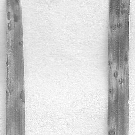
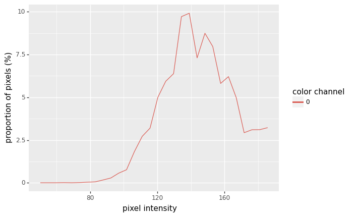
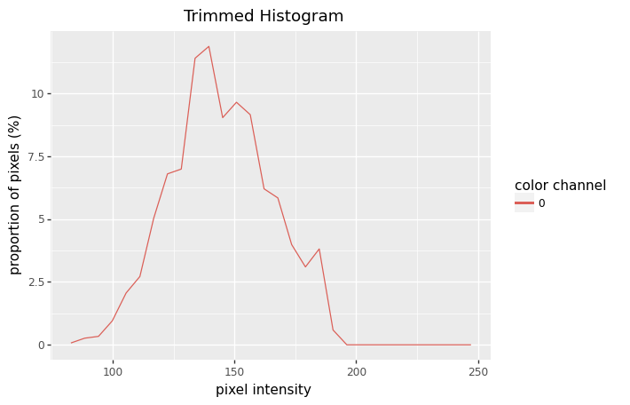
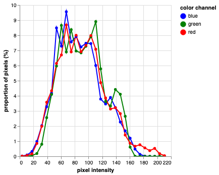

## Plot Histogram

This is a plotting method used to examine the distribution of signal within an image.

**plantcv.visualize.histogram**(*img, mask=None, bins=None, lower_bound=None, upper_bound=None, title=None, hist_data=False*)

**returns** fig_hist, hist_data

- **Parameters:**
    - img - Image data which is numpy.ndarray, the original image for analysis.
    - mask - Optional binary mask made from selected contours (default mask=None).
    - bins - Number of class to divide spectrum into (default bins=100).
    - lower_bound - lower bound of range to be shown in the histogram (default lower_range=None). 
    - upper_bound - upper bound of range to be shown in the histogram. 
    - title - The title for the histogram (default title=None) 
    - hist_data - Return histogram data if True (default hist_data=False)
    
**Context:**
- Examine the distribution of the signal, this can help select a value for calling the binary thresholding function.
    
- **Example use:**
    - [Grayscale Image Tutorial](tutorials/grayscale_tutorial.md)


**Grayscale image**



**Mask**


```python

from plantcv import plantcv as pcv

pcv.params.debug = "plot"

# Examine signal distribution within an image
# prints out an image histogram of signal within image
hist_figure1, hist_data1 = pcv.visualize.histogram(gray_img, mask=mask, hist_data=True)

# Alternatively, users can change the `bins`, `lower_bound`, `upper_bound` and `title`.
hist_figure2, hist_data2 = pcv.visualize.histogram(img=gray_img, mask=mask, bins=30, 
                                                   lower_bound=80, upper_bound=220,
                                                   title="Trimmed Histogram", hist_data=True)

```

**Histogram of signal intensity**





The histogram function plots histograms from 3 color bands automatically if an RGB input image is given.

**RGB image**


```python

from plantcv import plantcv as pcv

pcv.params.debug = "plot"

# Examine signal distribution within an image
# prints out an image histogram of signal within image
hist_figure, hist_data = pcv.visualize.histogram(img=rgb_img, mask=mask, hist_data=True)

```


**Source Code:** [Here](https://github.com/danforthcenter/plantcv/blob/main/plantcv/plantcv/visualize/histogram.py)
