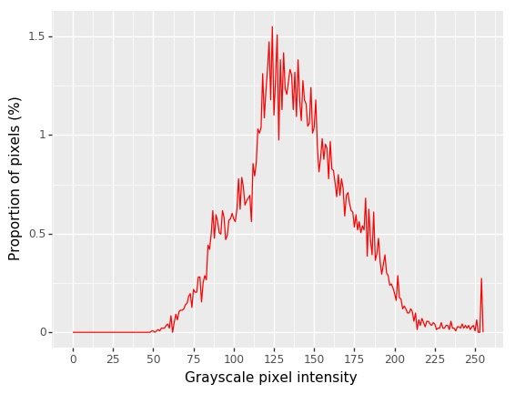

## Plot Histogram

This is a plotting method used to examine the distribution of signal within an image.

**plantcv.visualize.histogram**(*gray_img, mask=None, bins=256, color='red', title=None*)

**returns** hist_header, hist_data, fig_hist

- **Parameters:**
    - gray_img - Grayscale image data, the original image for analysis.
    - mask - Optional binary mask made from selected contours (default mask=None)
    - bins - Number of class to divide spectrum into (default bins=256)
    - color - The color of the line plot in the histogram (default color='red'). Users can input and color that is accepted by [plotnine ggplot](https://plotnine.readthedocs.io/en/stable/generated/plotnine.ggplot.html#plotnine.ggplot).
    - title - The title for the histogram (default title=None) 
**Context:**
    - Examine the distribution of the signal, this can help select a value for binary thresholding.
- **Example use:**
    - [Use In NIR Tutorial](nir_tutorial.md)

**Grayscale image**




**Mask**


```python

from plantcv import plantcv as pcv

# Examine signal distribution within an image
# prints out an image histogram of signal within image
header, hist_data, hist_figure = pcv.visualize.histogram(gray_img, mask=mask, bins=256, color='red', title=None)

```

**Histogram of signal intensity**



