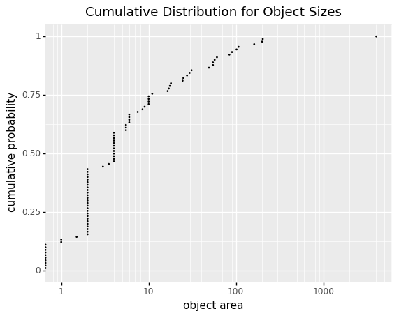

## Visualize Empirical Cumulative Distribution Function

This is a visualization method used to examine the distribution of object sizes. It is an alternative to histogram 
visualization.

**plantcv.visualize.ecdf.obj_size**(*mask, title=None*)
**returns** fig_ecdf

- **Parameters:**
    - mask - Binary mask made from selected contours (default mask=None).
    - title - The title for the ecdf plot (default title=None) 
    
**Context:**
- Examine the cumulative distribution of object sizes found in a binary mask. This can be used as an alternative 
  to histogram visualization.
- The y-axis presents the cumulative probability (range: [0,1]).  
- The x-axis presents the object area in common log-scale (logarithm with base 10)

- **Example use:**
    - Below
    
**Binary mask**


```python
from plantcv import plantcv as pcv
pcv.params.debug = "plot"
fig_ecdf = pcv.visualize.ecdf.obj_size(mask=mask)
```

**Cumulative distribution of object sizes**



**Source Code:** [Here](https://github.com/danforthcenter/plantcv/blob/master/plantcv/plantcv/visualize/obj_size_ecdf.py)
