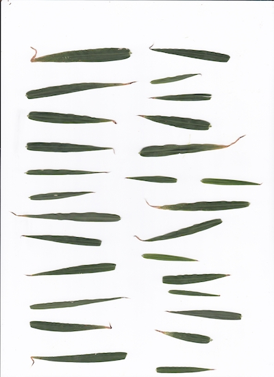
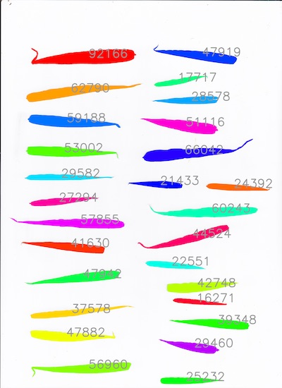

## Visualize object sizes

This function plots separate objects as different colors and annotates the largest objects with their respective sizes. 

**plantcv.visualize.obj_sizes**(*img, mask, num_objects=100*)

**returns** plotting_img 

- **Parameters:**
    - img         - RGB or grayscale image data for plotting annotations.
    - mask        - Binary mask made from selected contours.
    - num_objects - Optional parameter to limit the number of objects that will get annotated, default `num_objects=100`).

- **Context:**
    - Used to annotate object sizes in a binary mask. This visualization aims to streamline the workflow building process, 
    especially while deciding the `size` threshold for a [fill](fill.md) step.  
- **Example use:**
    - Below 

**Original image:**



**Binary mask:**


```python

from plantcv import plantcv as pcv

pcv.params.debug='plot'

plotting_img = pcv.visualize.obj_sizes(img=rgb_img, mask=mask, num_objects=27)

```

**Output Visualization**




**Source Code:** [Here](https://github.com/danforthcenter/plantcv/blob/master/plantcv/plantcv/visualize/sizes.py)
