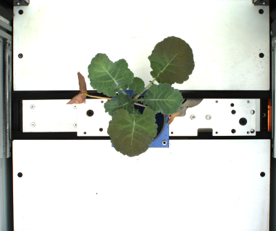
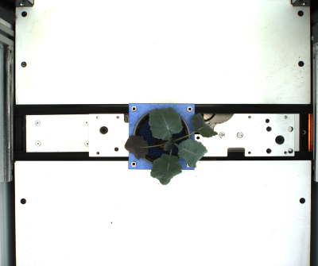
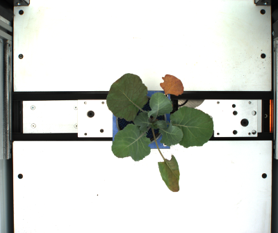
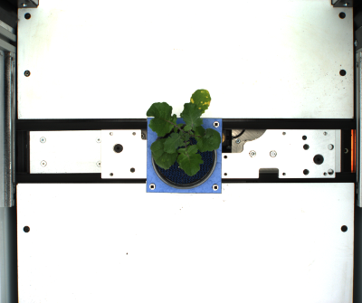
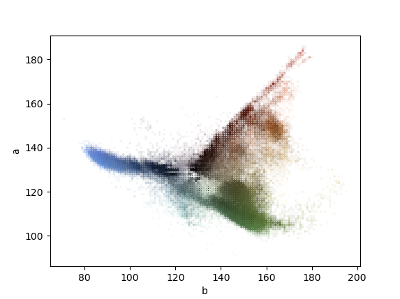
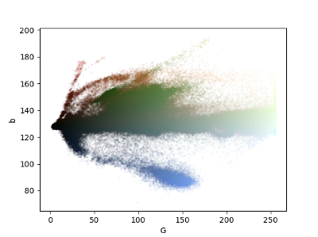

## Pixel scatter visualization

This function plots a 2D pixel scatter visualization for a dataset of images. The horizontal and vertical coordinates are defined by the intensity of the pixels in the specified channels. The color of each dot is given by the original RGB color of the pixel.

**plantcv.visualize.pixel_scatter_vis**(*paths_to_imgs, x_channel, y_channel*)

**returns** fig, ax

- **Parameters:**
    - paths_to_imgs   - List of paths to the images.
    - x_channel       - Channel to use for the horizontal coordinate of the scatter plot.
    Options:  'R', 'G', 'B', 'l', 'a', 'b', 'h', 's', 'v', 'gray', and 'index'.
    - y_channel       - Channel to use for the vertical coordinate of the scatter plot.
    Options:  'R', 'G', 'B', 'l', 'a', 'b', 'h', 's', 'v', 'gray', and 'index'.


- **Context:**
    - The aim of this visualization is to help selecting the threshold parameters to segment an image or dataset of
      images. This visualization can show the pixels in several images at once, making the selected value more
      likely to be valid for the whole dataset.


- **Example use:**
    - Below

**Dataset images:**


```python

from plantcv import plantcv as pcv

plotting_img = pcv.visualize.pixel_scatter_vis(paths_to_imgs=file_paths, x_channel='index', y_channel='G')

plotting_img = pcv.visualize.pixel_scatter_vis(paths_to_imgs=file_paths, x_channel='index', y_channel='s')

```

**Pixel scatter visualizations:**


**Dataset images:**







```python

from plantcv import plantcv as pcv

plotting_img = pcv.visualize.pixel_scatter_vis(paths_to_imgs=file_paths, x_channel='b', y_channel='a')

plotting_img = pcv.visualize.pixel_scatter_vis(paths_to_imgs=file_paths, x_channel='G', y_channel='b')

```

**Pixel scatter visualizations:**






**Source Code:** [Here](https://github.com/danforthcenter/plantcv/blob/master/plantcv/plantcv/visualize/pixel_scatter_vis.py)
