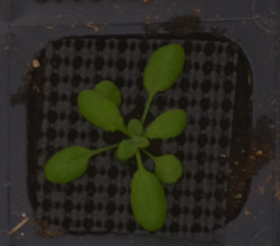

## Pixel scatter visualization

This function plots a 2D pixel scatter visualization for a dataset of images. The vertical coordinate for each point
is defined by the intensity of the pixel in the selected channel. The horizontal coordinate is defined by the pixel's
linear position in the image. The color of each dot is given by the original RGB color of the pixel.

**plantcv.visualize.pixel_scatter_vis**(*paths_to_imgs, channel*)

**returns**

- **Parameters:**
    - paths_to_imgs   - List of paths to the images.
    - channel         - Channel to use for the vertical coordinate of the scatter plot.
    Options:  'R', 'G', 'B', 'l', 'a', 'b', 'h', 's', 'v', and 'gray'.


- **Context:**
    - The aim of this visualization is to help selecting a value for a threshold to segment an image or dataset of
      images. This visualization can show the pixels in several images at once, making the selected value more
      likely to be valid for the whole dataset.


- **Example use:**
    - Below

**Dataset images:**




```python

from plantcv import plantcv as pcv

plotting_img = pcv.visualize.pixel_scatter_vis(paths_to_imgs=file_paths, channel='G')

plotting_img = pcv.visualize.pixel_scatter_vis(paths_to_imgs=file_paths, channel='s')

```

**Pixel scatter visualizations:**


**Source Code:** [Here](https://github.com/danforthcenter/plantcv/blob/master/plantcv/plantcv/visualize/pixel_scatter_vis.py)
