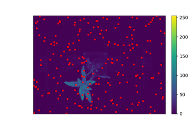

## Pseudocolor Grayscale Image

This function pseudocolors any grayscale image to a custom colormap. An optional mask can leave background out in the
pseudocolored image. Additionally, optional maximum and minimum values can be specified. When `pcv.params.debug='print'`
then the image gets saved to `pcv.params.debug_outdir`, and`pcv.params.dpi` can be set for the image that gets saved. If
unaltered, the  matplotlib default DPI is 100 pixels per inch.

**plantcv.visualize.pseudocolor**(*gray_img, obj=None, mask=None, background="image", cmap=None, min_value=0, max_value=255, axes=True, colorbar=True, obj_padding='auto', bad_mask=None, bad_color="red"*)

**returns** pseudocolored image (that can be saved with `pcv.print_image`)

- **Parameters:**
    - gray_img       - Grayscale image data
    - obj            - ROI or plant contour object (optional) if provided, the pseudocolored image gets cropped down to the region of interest. "obj" can be the 1st output of the PlantCV region of interests functions, e.g. `pcv.roi.rectangle`.
    - mask           - Binary mask made from selected contours (optional)
    - cmap           - Custom colormap, see [here](https://matplotlib.org/tutorials/colors/colormaps.html) for tips on how to choose a colormap in Matplotlib.
    - background     - Background color/type. Options are "image" (default), "white", or "black". A mask must be supplied in order to utilize this parameter.
    - min_value      - Minimum value (optional) for range of the colorbar. Default: 0
    - max_value      - Maximum value (optional) for range of the colorbar. Default: 255
    - axes           - If False then the title, x-axis, and y-axis won't be displayed (default axes=True).
    - colorbar       - If False then the colorbar won't be displayed (default colorbar=True)
    - obj_padding    - if "auto" (default), and an obj is supplied, then the image is cropped to an extent 20% larger in each dimension than the object. A single integer is also accepted to define the padding in pixels.
    - title          - The title for the pseudocolored image (default title=None) 
    - bad_mask       - binary mask of pixels with "bad" values, e.g. nan or inf or any other values considered to be not informative and should be excluded from analysis. default = None
    - bad_color      - The color that shows "bad" pixels in output pseudocolored image, default: "red"
  
- **Context:**
    - Used to pseudocolor any grayscale image to custom colormap
- **Example use:**
    - [Interactive Documentation](https://mybinder.org/v2/gh/danforthcenter/plantcv-binder.git/master?filepath=notebooks%2FpsII_tutorial.ipynb)

**Original grayscale image**


**Mask**


**Mask of "bad" values**


```python

from plantcv import plantcv as pcv

pcv.params.debug='plot'

# Pseudocolor an image with 'viridis' colormap
pseudo_img = pcv.visualize.pseudocolor(gray_img=img, obj=None, mask=None, cmap='viridis',
                                       min_value=0, max_value=255)

# Pseudocolor the same image but include the mask and limit the range of values
pseudo_img_masked = pcv.visualize.pseudocolor(gray_img=img, obj=None, mask=mask,
                                              background="white", cmap='viridis',
                                              min_value=30, max_value=200)

# Save the masked and pseudocolored image
pcv.print_image(pseudo_img_masked, 'nir_tv_z300_L1_pseudocolored.png')

# Pseudocolor the masked area and plot on the grayscale background
pseudo_img_on_input = pcv.visualize.pseudocolor(gray_img=img, obj=None, mask=mask,
                                                background="image", cmap="viridis")

# Print out a pseudocolored image with cropping enabled, axes disabled.
pcv.params.debug='print'
pseudo_crop_no_axes = pcv.visualize.pseudocolor(gray_img=img, obj=obj, mask=mask,
                                                background="white", cmap='viridis',
                                                axes=False, obj_padding = 'auto')

# Use a black background instead
pseudo_img_black_bkgd = pcv.visualize.pseudocolor(gray_img=img, obj=None, mask=mask,
                                                  background="black", cmap='viridis')

simple_pseudo_img = pcv.visualize.pseudocolor(gray_img=img, obj=None, mask=mask,
                                              background="image", axes=False,
                                              colorbar=False, cmap='viridis')

# When there are some user defined "bad" pixels indicated in array "bad_mask", and the red color is used to visualize them in the visualization.
pseudo_img_bad_mask = pcv.visualize.pseudocolor(gray_img=img, obj=None, mask=None, bad_mask=bad_mask, bad_color="red", axes=False, colorbar=False)

# When there are some user defined "bad" pixels indicated in array "bad_mask", and the red color is used to visualize them in the visualization.
pseudo_img_mask_obj_bad_mask = pcv.visualize.pseudocolor(gray_img=img, obj=obg, mask=mask, background="white", bad_mask=bad_mask, bad_color="red", axes=False, colorbar=True)
```

**Pseudocolored Image**


**Pseudocolored, background="white"**


**Pseudocolored, background="image"**


**Pseudocolored, Cropped, Disabled Axes Image**


**Pseudocolored, background="black"**


**Pseudocolored, Plotted on Input Image (no axes or colorbar)**


**Pseudocolored, Pixels With User Defined "bad" Values Marked Using Red Color (no axes or colorbar)**


**Pseudocolored, Cropped, background="white", Pixels With User Defined "bad" Values Marked Using Red Color (no axes)**


**Source Code:** [Here](https://github.com/danforthcenter/plantcv/blob/master/plantcv/plantcv/visualize/pseudocolor.py)
