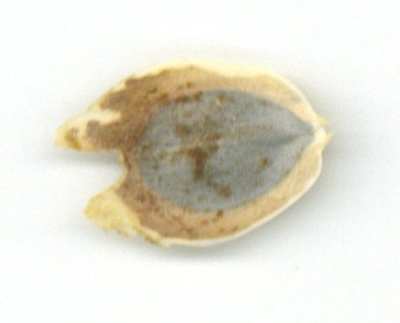
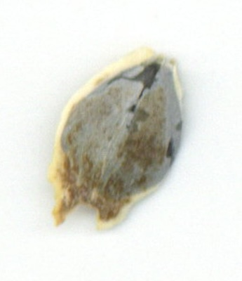
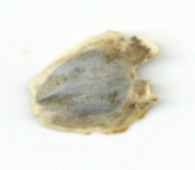
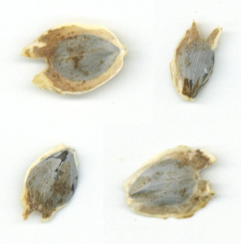

## Visualize composite of image tiles

This is a plotting method used to examine several output versions, such as from different model fits with varying parameters, all at once.

**plantcv.visualize.tile**(*images, ncol*)

**returns** comp_img

- **Parameters:**
    - images - A list of numpy arrays to tile into a composite.
    - ncol - Number of columns in composite output. Number of rows is calculated from the number of input images.

- **Example use:**
    - Below


```python

from plantcv import plantcv as pcv
import os

# Read in a list of images
images = []
for i in os.listdir("./test_images/"):
    images.append(pcv.readimage("./test_images/"+i)[0])

# Examine all images at once
composite = pcv.visualize.tile(images=images, ncol=2)

```

**Input images**








**Output**



**Source Code:** [Here](https://github.com/danforthcenter/plantcv/blob/main/plantcv/plantcv/visualize/tile.py)