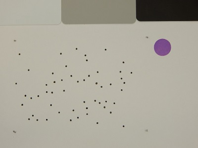
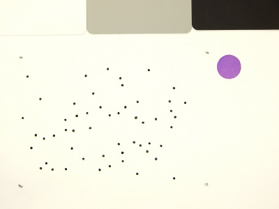

## White Balance

Corrects the exposure of an image. A color standard can be specified.

**plantcv.white_balance**(*img, mode='hist', roi=None*)

**returns** corrected_img

- **Parameters:**
    - img - RGB (or grayscale, though not recommended) image data on which to perform the correction
    - mode - either 'hist' or 'max'. If 'hist' (default) method is used a histogram for the whole image or the specified ROI is calculated, and the
    bin with the most pixels is used as a reference point to shift image values. If 'max' is used as a method, then the pixel with the maximum
    value in the whole image or the specified ROI is used as a reference point to shift image values.
    - roi - A list of 4 points (x, y, width, height) that form the rectangular ROI of the white color standard.
            If a list of 4 points is not given, the whole image is used (default: None)

- **Context:**
    - Used to standardize exposure of images before thresholding

**Original image**



```python

from plantcv import plantcv as pcv

# Set global debug behavior to None (default), "print" (to file), or "plot" (Jupyter Notebooks or X11)
pcv.params.debug = "print"

# Corrects image based on color standard and stores output as corrected_img
corrected_img = pcv.white_balance(img, mode='hist', roi=(5, 5, 80, 80))
```


**Corrected image**


