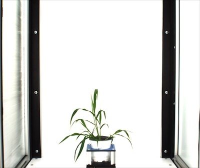
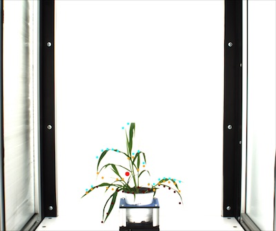

## x_axis_pseudolandmarks

Divide plant object into twenty equidistant bins and assign pseudolandmark points based upon their actual (not scaled) position.
Once this data is scaled this approach may provide some information regarding shape independent of size.

**plantcv.x_axis_pseudolandmarks**(*obj, mask, img*)

**returns** landmarks_on_top (top), landmarks_on_bottom (bottom), landmarks_at_center_along_the_vertical_axis (center_V)

- **Parameters:**
    - obj - A contour of the plant object (this should be output from the object_composition.py fxn)
    - mask - This is a binary image. The object should be white and the background should be black.
    - img - A copy of the original image (RGB or grayscale) generated using np.copy
- **Context:**
    - Used to identify a set of sixty equidistant landmarks on the horizontal axis. Once scaled these can be used for shape analysis.
    
**Input object contour and image**



```python
from plantcv import plantcv as pcv

# Set global debug behavior to None (default), "print" (to file), or "plot" (Jupyter Notebooks or X11)
pcv.params.debug = "plot"

# Identify a set of land mark points
# Results in set of point values that may indicate tip points
top, bottom, center_v = pcv.x_axis_pseudolandmarks(obj, mask, img)
```

**Image of points selected**


